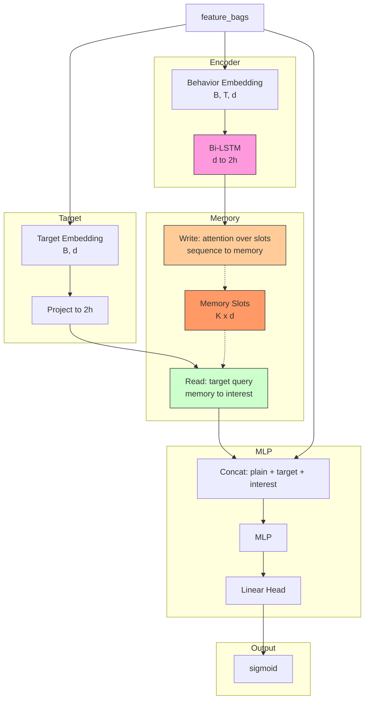

# MIMN (Multi-channel Interest with Moment Network)

## Model Architecture

MIMN uses a **multi-slot memory network** to capture multiple aspects of user interests. Unlike DIN/DIEN which compress behavior into a single vector, MIMN maintains K memory slots that jointly represent the interest distribution.



### Memory Write

Each LSTM state at step t writes to the memory via attention:

w_t = softmax(Proj(h_t) x M^T)

M = M + sum(w_t_i x h_t)

### Memory Read

The target item reads from memory via attention:

w = softmax(Proj(q) x M^T)

interest = sum(w_i x M_i)

## Configuration

```yaml
interest_extractor:
  lstm_hidden: 64
  num_memory_slots: 8
```

## Launch

```bash
python -m gerbil_train.cli.10-mimn_train --config configs/10-mimn/experiment.yaml
```

## Sequential Model Comparison

| Model | Interest Representation | Key Technique |
|-------|------------------------|---------------|
| DIN | Single vector | Attention pooling |
| DIEN | Single evolving vector | GRU + AUGRU |
| DSIN | Session vectors | Bi-LSTM + Self-Attn |
| MIMN | Multi-slot distribution | Memory network |
