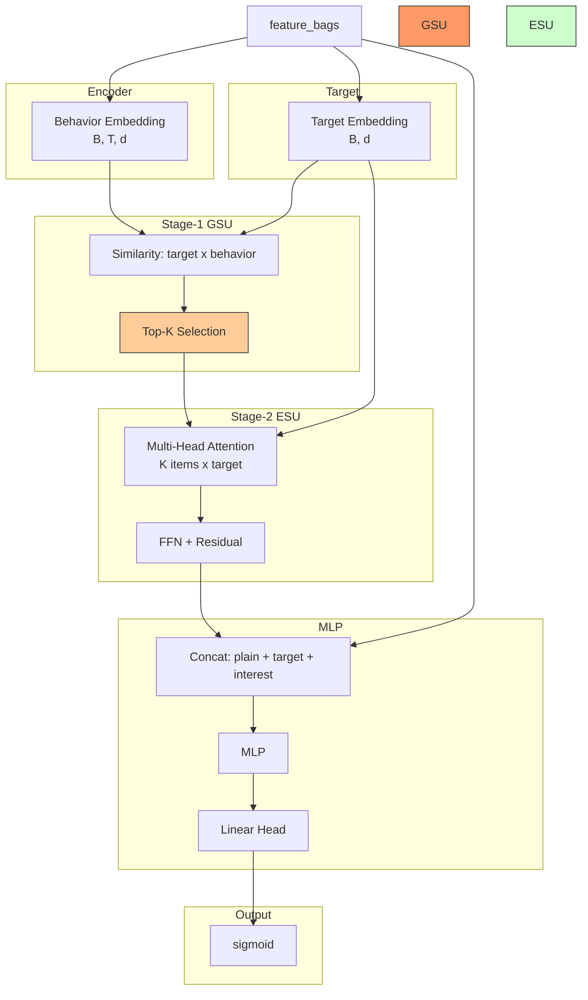

# SIM (Search-based Interest Model)

## Model Architecture

SIM extends the modeling of user interests from **long-term behavior sequences** (thousands of items) via a two-stage search-based approach:



### Stage 1: GSU (General Search Unit)

Retrieves top-K items from the full behavior sequence most relevant to the target item:

- **Soft Search**: dot product similarity between target embedding and each behavior item
- **Masking**: padded positions filled with -inf before top-K
- **Output**: top-K item embeddings [B, K, d] + similarity scores

### Stage 2: ESU (Exact Search Unit)

Applies multi-head cross-attention over the retrieved K items:

- Target item → Query
- Top-K items → Key & Value (from GSU)
- Residual connection → FFN → LayerNorm
- **Output**: interest vector [B, d]

## Configuration

```yaml
interest_extractor:
  top_k: 20       # number of items to retrieve
  esu_heads: 4    # attention heads in ESU
```

## Launch

```bash
python -m gerbil_train.cli.11-sim_train --config configs/11-sim/experiment.yaml
```

## Sequential Model Comparison

| Model | Interest | Sequence Handling | Key Innovation |
|-------|----------|-------------------|----------------|
| DIN | Single | All items → weighted sum | Attention |
| DIEN | Single, evolving | GRU through items | Auxiliary loss + AUGRU |
| DSIN | Session vectors | Split by session, self-attn | Session division |
| MIMN | Multi-slot | Memory network | Scalable to long seq |
| **SIM** | **Single top-K** | **Retrieve → Attend** | **Two-stage search** |
