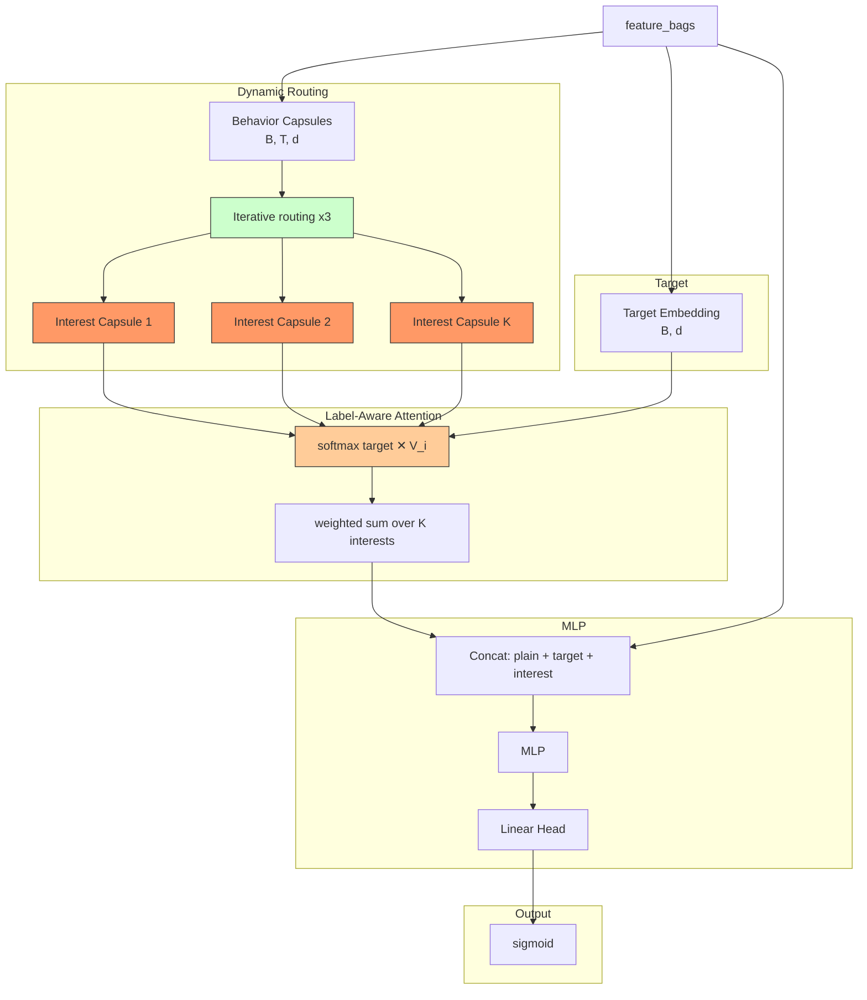

# MIND (Multi-Interest Network with Dynamic Routing)

## Model Architecture

MIND introduces **multi-interest representation** via capsule-based dynamic routing, allowing the model to capture **multiple aspects** of a user's interests from behavior sequences.



### Dynamic Routing (B2I)

Each behavior item is a **behavior capsule**. Interest capsules are iteratively refined:

1. **Bilinear projection**: `u_hat = W * behavior_emb` — projects behavior to K interest spaces
2. **Routing by agreement**: for each iteration:
   - Softmax routing logits → attention weights
   - Weighted sum → interest capsule candidates
   - Squash non-linearity
   - Update logits by `agreement = u_hat · v`

### Label-Aware Attention

For target item t, select the most relevant interest capsule:

```
α_i = exp(t^T v_i) / Σ exp(t^T v_j)
interest = Σ α_i v_i
```

This lets the model choose which interest dimension is triggered by the current target.

## Configuration

```yaml
interest_extractor:
  num_interests: 4    # K interest capsules
  routing_iters: 3    # routing iterations
```

## Launch

```bash
python -m gerbil_train.cli.12-mind_train --config configs/12-mind/experiment.yaml
```

## Sequential Model Comparison

| Model | Interest Type | Extraction Mechanism |
|-------|--------------|---------------------|
| DIN | Single vector | Attention pooling over all items |
| DIEN | Single evolving | GRU + AUGRU with auxiliary loss |
| DSIN | Session vectors | Session division + Bi-LSTM + Self-Attn |
| MIMN | Multi-slot distribution | Memory network (write/read) |
| SIM | Single top-K | GSU retrieval + ESU cross-attention |
| **MIND** | **Multi-vector (K)** | **Dynamic routing (CapsNet)** |
