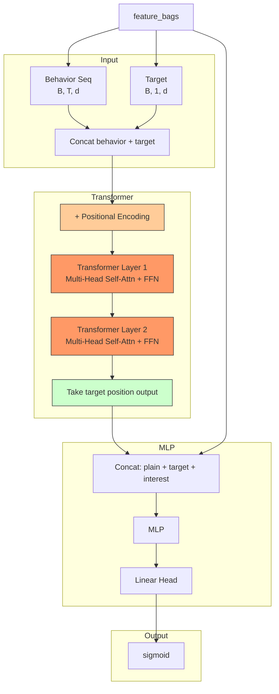

# BST (Behavior Sequence Transformer)

## Model Architecture

BST applies **Transformer encoder** to user behavior sequences, where **self-attention** captures complex pairwise item-item interactions.



### Key Insight

DIN uses simple attention weighted-sum over all items. BST uses **self-attention** which models **item-item interactions** (e.g., "if user bought iPhone + AirPods, they're likely to buy MacBook"). This pairwise interaction is missing in DIN/DIEN.

### Positional Encoding

Since self-attention is permutation-invariant, BST adds learned position embeddings so the model knows item order in the sequence.

### Transformer Encoder

Standard Transformer with:
- Multi-head self-attention
- Feed-forward network (FFN)
- Residual connections + LayerNorm
- Key-padding mask for variable-length sequences

## Configuration

```yaml
interest_extractor:
  num_heads: 4       # attention heads
  num_layers: 2      # transformer layers
  ffn_hidden: 128    # FFN hidden size
  dropout: 0.1       # dropout rate
```

## Launch

```bash
python -m gerbil_train.cli.13-bst_train --config configs/13-bst/experiment.yaml
```

## Sequential Model Comparison

| Model | Interest Extraction | Item-Item Interaction |
|-------|-------------------|----------------------|
| DIN | Attention over all items | No (independent) |
| DIEN | GRU evolution + AUGRU | Sequential only |
| DSIN | Session segmentation + Bi-LSTM | Within-session |
| MIMN | Memory network | Via memory slots |
| SIM | GSU retrieval + ESU | Among top-K only |
| MIND | Dynamic routing (CapsNet) | No (independent) |
| **BST** | **Transformer** | **Full pairwise via self-attn** |
