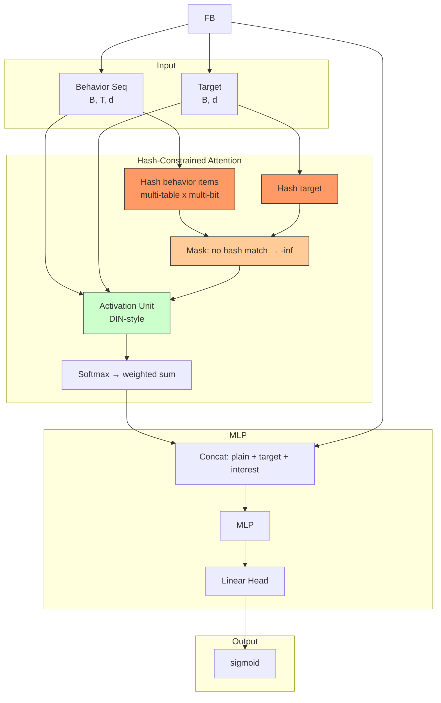

# ETA (End-to-end Target Attention)

## Model Architecture

ETA uses **locality-sensitive hashing (LSH)** to constrain target attention to only behavior items sharing a hash bucket, enabling efficient end-to-end attention over very long sequences.



### LSH Hashing

ETA uses m independent hash tables, each with k learnable bits:

```python
h(x) = sign(W_m · x)    # W_m: [d, k] learned projection
```

Multi-table + multi-bit ensures good recall: items need only match in **one** table.

### Hash-Constrained Attention

Unlike DIN which attends over ALL items, ETA only attends to items sharing a hash bucket with the target:

```
attention_mask = padding | no_hash_match
scores = activation_unit(seq, target)
scores[mask] = -inf
attention = softmax(scores)
```

This reduces complexity from O(T) to O(T / 2^k) per table.

### Straight-Through Estimator

The sign function in hashing is non-differentiable. ETA uses a **straight-through estimator**: forward uses discrete {-1, 1} codes, but gradients flow through the continuous pre-activation scores, enabling end-to-end training.

## Configuration

```yaml
interest_extractor:
  num_tables: 4   # independent hash tables
  num_bits: 4     # bits per table (2^4 = 16 buckets per table)
```

## Launch

```bash
python -m gerbil_train.cli.14-eta_train --config configs/14-eta/experiment.yaml
```

## Sequential Model Comparison

| Model | Long-Seq Strategy | Complexity | Differentiable |
|-------|-------------------|-----------|----------------|
| DIN | Full attention | O(T) | Yes |
| SIM | GSU retrieve → ESU attend | O(T + K²) | No (hard top-K) |
| MIND | Capsule routing | O(T × K) | Yes |
| **ETA** | **LSH-constrained attention** | **O(f(T)) ≈ O(T/2^k)** | **Yes (STE)** |
