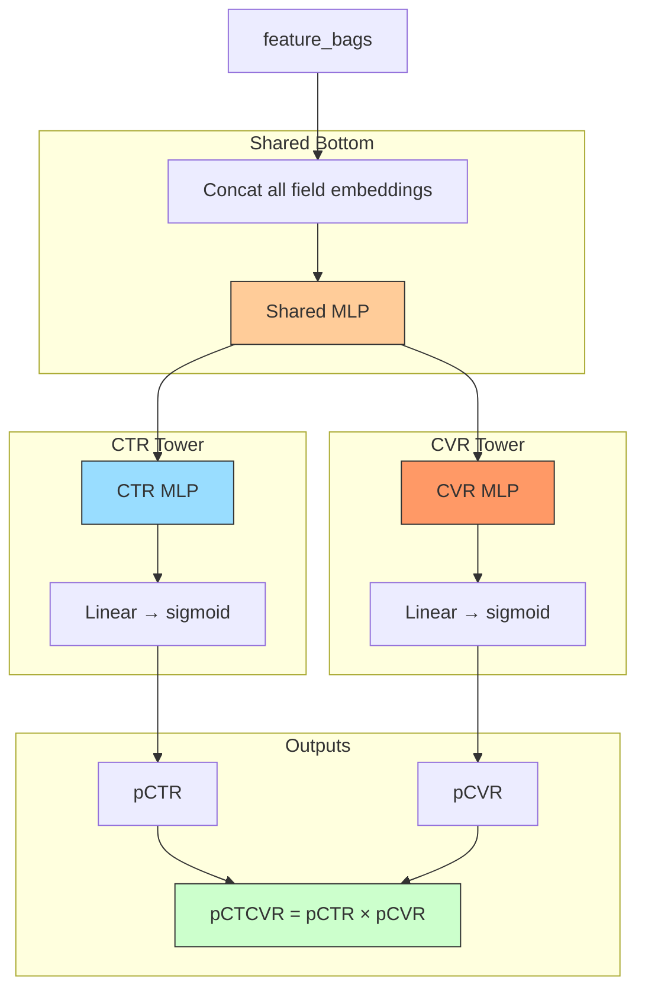

# ESMM (Entire Space Multi-Task Model)

## Model Architecture

ESMM jointly models **CTR** (Click-Through Rate) and **CVR** (Conversion Rate) using the relationship:

```
pCTCVR = pCTR × pCVR
```



### Training

```
Loss = BCE(pCTR, y_click) + BCE(pCTCVR, y_conversion)
```

Where:
- `y_click ∈ {0,1}` — whether the user clicked
- `y_conversion ∈ {0,1}` — whether the user converted after click
- `pCTCVR` is trained on the **entire space** (impressions + clicks + conversions)
- This alleviates **sample selection bias** (traditional CVR is only trained on clicked samples)

### Why Entire Space Matters

| Space | Samples | pCTR | pCVR | pCTCVR |
|-------|---------|------|------|--------|
| Impression | All | ✓ (label) | ✗ (noise) | ✓ (label = conversion) |
| Click | Only clicked | ✓ | ✓ (label) | ✓ |
| Conversion | Converted | ✓ | ✓ | ✓ |

## Configuration

```yaml
mlp:
  shared_hidden: [128, 64]
  ctr_hidden: [64, 32]
  cvr_hidden: [64, 32]
```

## Launch

```bash
python -m gerbil_train.cli.20-esmm_train --config configs/20-esmm/experiment.yaml
```

## References

- Ma, X., et al. "Entire Space Multi-Task Model: An Effective Approach for Estimating Post-Click Conversion Rate." KDD 2018.
