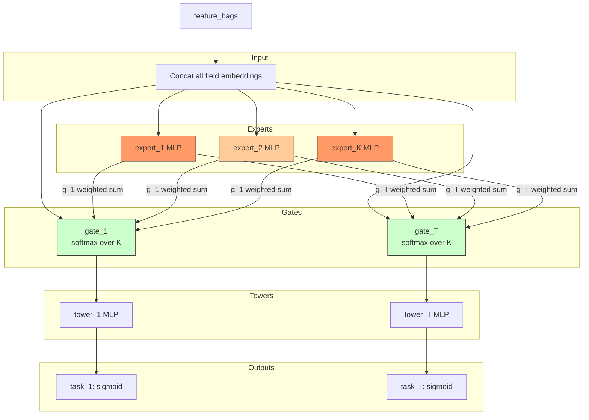

# MMoE (Multi-gate Mixture-of-Experts)

## Model Architecture

MMoE shares K expert networks across T tasks, with task-specific gates:

```python
f_t(x) = tower_t( Σ_k g_t(x)_k · expert_k(x) )
```



### Key Insight

Unlike Shared-Bottom (one shared representation for all tasks), MMoE allows
each task to **selectively use different experts**, so tasks can share knowledge
when beneficial while maintaining task-specific capacity.

## Configuration

```yaml
mlp:
  num_experts: 8              # K shared experts
  expert_hidden: [128, 64]    # each expert's MLP
  gate_hidden: [32]           # gate MLP (optional)
  tower_hidden: [64, 32]      # per-task tower
  num_tasks: 2                # number of tasks
  task_names: [rating, click] # task output names
  dropout: 0.1
```

## Launch

```bash
python -m gerbil_train.cli.21-mmoe_train --config configs/21-mmoe/experiment.yaml
```

## Multi-Task Model Comparison

| Model | Task Relationship | Sharing Mechanism |
|-------|------------------|-------------------|
| Shared-Bottom | **Hard** parameter sharing | Single shared bottom |
| **MMoE** | **Soft** routing via gates | Weighted experts per task |
