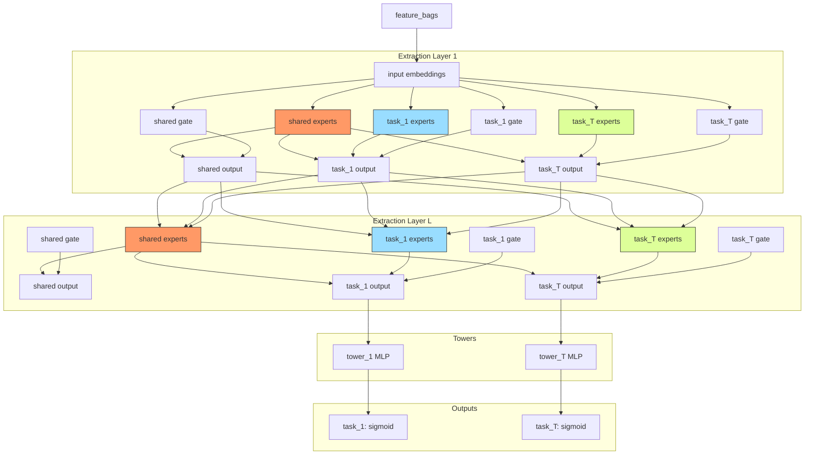

# PLE (Progressive Layered Extraction)

## Model Architecture

PLE extends MMoE with **multi-level extraction layers**, progressively separating shared and task-specific knowledge:

```
f_t(x) = tower_t( gate_t( expert_shared ⊕ expert_specific_t ) )
```



### Progressive Separation

| Layer | Shared Experts | Task-Specific Experts | Gate Selection |
|-------|---------------|----------------------|----------------|
| 1 | High overlap | Few | Both shared & specific |
| L | Separated | Many | Task-specific focus |

## Multi-Task Model Comparison

| Model | Layers | Expert Separation | Gate |
|-------|--------|-------------------|------|
| Shared-Bottom | 1 | None | None |
| MMoE | 1 | Shared only | Per task |
| **PLE** | **L** | **Shared + per-task per layer** | **Per task (shared ⊕ specific)** |

## Configuration

```yaml
mlp:
  num_layers: 2
  num_shared_experts: 4
  num_specific_experts: 2
  expert_hidden: [64]
  tower_hidden: [32]
  num_tasks: 2
  task_names: [rating, click]
```

## Launch

```bash
python -m gerbil_train.cli.22-ple_train --config configs/22-ple/experiment.yaml
```

## References

- Tang, H., et al. "Progressive Layered Extraction (PLE): A Novel Multi-Task Learning Model for Personalized Recommendations." RecSys 2020.
