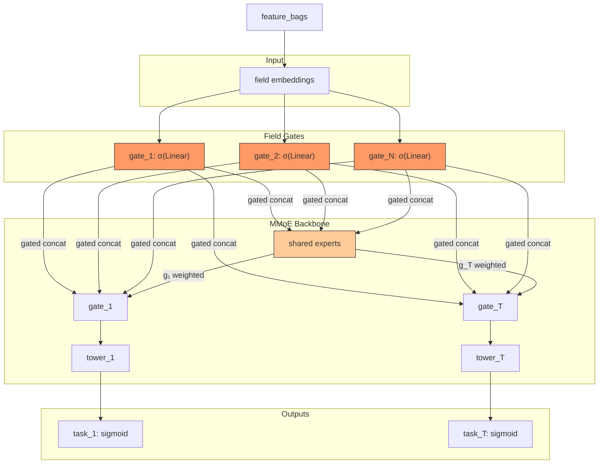

# GateNet

## Model Architecture

GateNet adds **per-field learnable gates** before the MMoE backbone:

```
gated_field_i = field_emb_i ⊙ σ(Linear(field_emb_i))
concat(gated_1, ..., gated_N) → MMoE (experts + gates + towers) → tasks
```



### Field Gate

Each field embedding passes through a sigmoid gate:

```
gate_i = σ(W_i · emb_i + b_i)
output_i = emb_i ⊙ gate_i
```

This allows the model to learn which feature dimensions to keep or suppress.

## Multi-Task Model Comparison

| Model | Feature Gating | Expert Sharing | Task Gating |
|-------|---------------|----------------|-------------|
| MMoE | None | Shared | Per task |
| PLE | None | Shared + specific | Per task, per layer |
| PEPNet | **EPNet** (scale/bias) | Shared | Per task |
| **GateNet** | **Per-field sigmoid** | Shared | Per task |

## Configuration

```yaml
mlp:
  num_experts: 8
  expert_hidden: [128, 64]
  gate_hidden: [32]
  tower_hidden: [64, 32]
  num_tasks: 2
  task_names: [rating, click]
```

## Launch

```bash
python -m gerbil_train.cli.23-gatenet_train --config configs/23-gatenet/experiment.yaml
```
