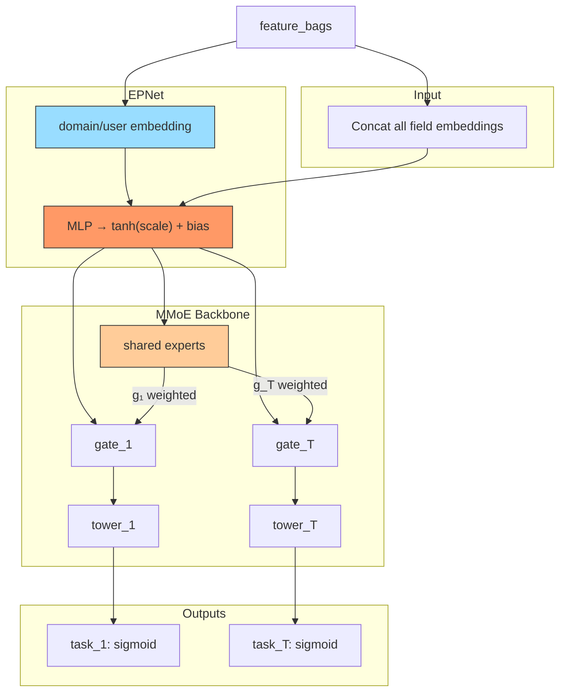

# PEPNet (Parameter Efficient Personalized Network)

## Model Architecture

PEPNet personalizes the base model via **EPNet** (Embedding Personalized Network):

```
EPNet: condition_emb → MLP → scale & bias → applied to input features
MMoE:  personalized features → experts → gates → towers → tasks
```



### EPNet Detail

```
condition_embedding → [Linear → ReLU → Linear] → [scale (tanh), bias]
x_personalized = x * tanh(scale) + bias
```

### Multi-Task Model Comparison

| Model | Personalization | Expert Sharing | Parameter Generation |
|-------|----------------|----------------|---------------------|
| MMoE | None | Shared | None |
| PLE | None | Shared + specific | None |
| **PEPNet** | **EPNet: scale/bias** | Shared | **Conditioned on domain** |

## Configuration

```yaml
mlp:
  domain_field: user_id
  epnet_hidden: [64, 32]
  num_experts: 8
  expert_hidden: [128, 64]
  tower_hidden: [64, 32]
  num_tasks: 2
  task_names: [rating, click]
```

## Launch

```bash
python -m gerbil_train.cli.23-pepnet_train --config configs/23-pepnet/experiment.yaml
```

## References

- Chang, J., et al. "PEPNet: Parameter Efficient Personalized Network." WWW 2023.
