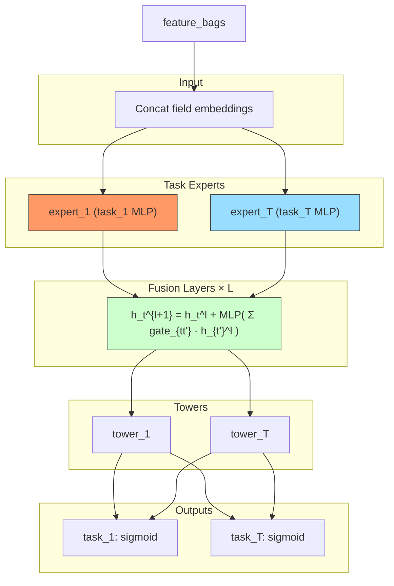

# AdaTT (Adaptive Task-to-Task Fusion Network)

## Model Architecture

AdaTT uses **task-specific experts** and **progressive task-to-task fusion**:



### Task-to-Task Fusion

Each task t computes a **sample-dependent gate** over all tasks:

```
gate_t = softmax(W_gate_t · h_t)
h_fused = Σ_{t'} gate_t[t'] · h_{t'}
h_t^{l+1} = h_t^l + ReLU(Linear(h_fused))
```

## Multi-Task Model Comparison

| Model | Experts | Task Interaction | Fusion Type |
|-------|---------|-----------------|-------------|
| MMoE | Shared | Via shared experts | Softmax gate |
| PLE | Shared + specific | Per-layer shared/specific | Extraction |
| ESMM | Shared bottom | CTR ↔ CVR product | pCTCVR = pCTR × pCVR |
| PEPNet | Shared (personalized) | EPNet scale/bias | Personalization |
| **AdaTT** | **Per-task** | **Task-to-task gate** | **Cross-task attention** |

## Configuration

```yaml
mlp:
  num_layers: 2
  task_dim: 64
  expert_hidden: 128
  tower_hidden: [32]
  num_tasks: 2
  task_names: [rating, click]
```

## Launch

```bash
python -m gerbil_train.cli.24-adatt_train --config configs/24-adatt/experiment.yaml
```
