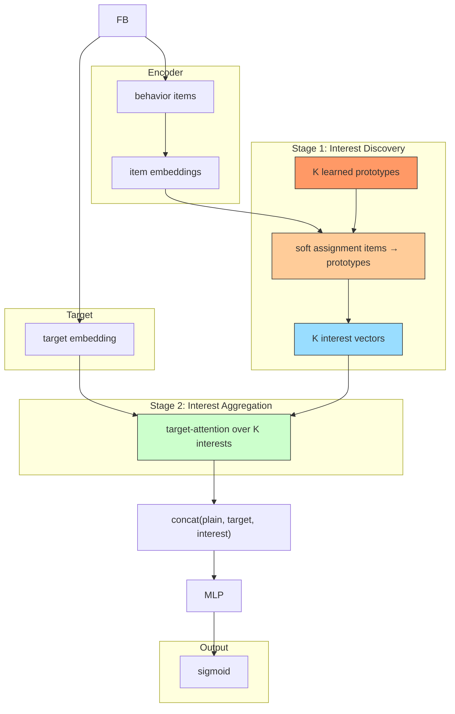

# TWIN (Two-stage Interest Discovery Network)

## Model Architecture

TWIN discovers multi-interest via prototype assignment, then aggregates via target-aware attention:



### Stage 1: Interest Discovery

Each item assigns to K interest prototypes via softmax similarity:

```
assignment = softmax(seq_emb · prototypes^T)
interest_k = Σ assignment_k · item_emb / ||...||
```

### Stage 2: Interest Aggregation

Target attends over K discovered interests:

```
score_k = MLP(concat(interest_k, target))
attention = softmax(scores)
interest = Σ attention_k · interest_k
```

## Sequential Model Comparison

| Model | Interest Extraction | Number of Interests | Mechanism |
|-------|-------------------|-------------------|-----------|
| DIN | Single | 1 | Attention over all items |
| MIND | Multiple | K (config) | Dynamic routing (CapsNet) |
| **TWIN** | **Multiple** | **K (config)** | **Prototype assignment + target attn** |

## Configuration

```yaml
interest_extractor:
  num_interests: 4
```

## Launch

```bash
python -m gerbil_train.cli.25-twin_train --config configs/25-twin/experiment.yaml
```
