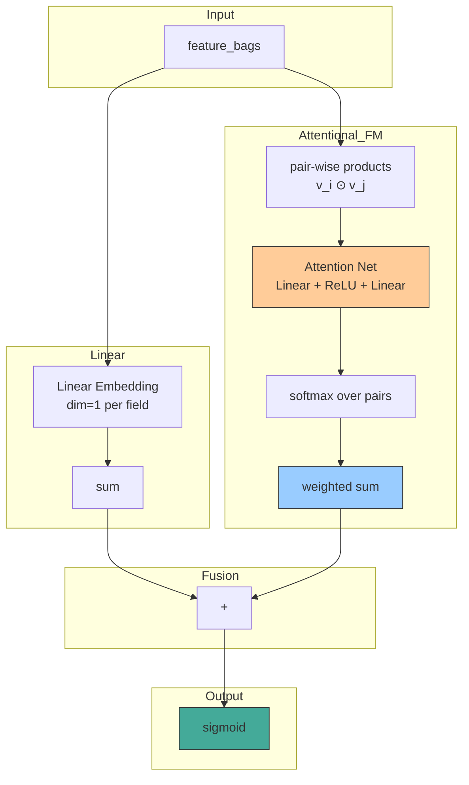

# AFM (Attentional Factorization Machine)

## Model Architecture

AFM extends FM by learning an **attention weight** for each pair-wise feature interaction via a small MLP.

$$ \hat{y} = \underbrace{w_0 + \sum_i w_i x_i}_{\text{Linear}} + \underbrace{\sum_{i=1}^n \sum_{j=i+1}^n a_{ij} \cdot (v_i \odot v_j)}_{\text{Attentional FM}} $$

### Attention Mechanism

Each pair's attention score is computed by:

$$ a'_{ij} = h^T \cdot \text{ReLU}(W \cdot (v_i \odot v_j) + b) $$

$$ a_{ij} = \frac{\exp(a'_{ij})}{\sum_{(p,q)} \exp(a'_{pq})} $$



## Configuration

```yaml
# configs/3-afm/model.yaml
afm_attention:
  hidden_size: 128
  dropout: 0.0

mlp:
  hidden_dims: []
  activation: relu
  dropout: 0.0
  batch_norm: false
  input_batch_norm: false
```

## Launch

```bash
python -m gerbil_train.cli.3-afm_train --config configs/3-afm/experiment.yaml
```
