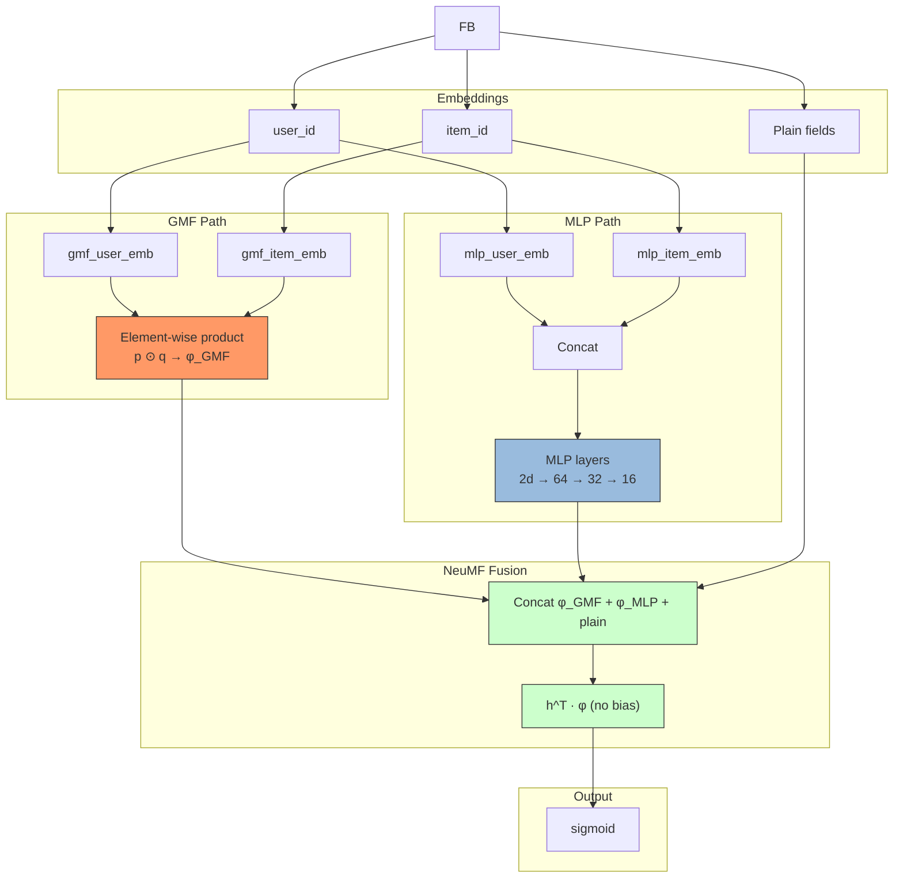

# NCF (Neural Collaborative Filtering)

## Model Architecture

NeuMF (Neural Matrix Factorization) fuses **GMF** and **MLP** at the **vector level**:

- **GMF**: p_u^G ⊙ q_i^G → φ_GMF (element-wise product vector)
- **MLP**: [p_u^M; q_i^M] → MLP → φ_MLP (last hidden layer vector)
- **Fusion**: h^T · [φ_GMF; φ_MLP; plain] → σ (no bias)

GMF and MLP use **separate** user/item embeddings (per paper Section 3.4).



## Differences from Simple MF

| | MF (Matrix Factorization) | NCF (NeuMF) |
|--|--------------------------|-------------|
| Interaction | ⟨p_u, q_i⟩ (inner product) | GMF(⊙) + MLP(concat→MLP) |
| Linearity | Linear only | **Linear (GMF) + Non-linear (MLP)** |
| Embeddings | Shared | **Separate for GMF / MLP** |
| Fusion | N/A | **Vector-level concat → h^T** |

## Configuration

```yaml
mlp:
  user_field: user_id         # designate user field
  item_field: user_movie_rate # designate item field
  hidden_dims: [64, 32, 16]   # MLP layers (tower pattern)
  activation: relu
  dropout: 0.1
  batch_norm: true
```

## Launch

```bash
python -m gerbil_train.cli.3-ncf_train --config configs/3-ncf/experiment.yaml
```

## References

- He, X., et al. "Neural Collaborative Filtering." WWW 2017.
