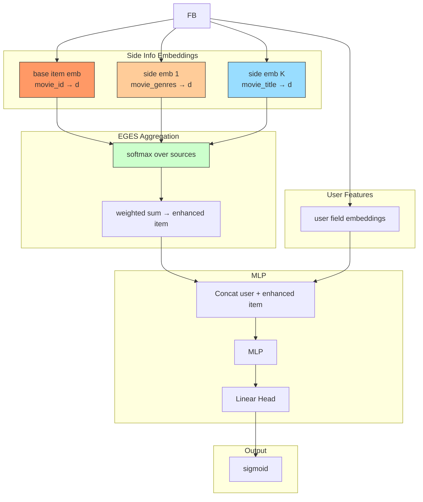

# EGES (Enhanced Graph Embedding with Side Information)

## Model Architecture

EGES enhances item embeddings by incorporating **side information** (genre, title, brand, etc.) via learned attention weights:

```
e_item = softmax(a)₀·v_base + Σ softmax(a)ₖ·v_sideₖ
```



### Attention Weights

Global learned attention vector `a = [a_0, a_1, ..., a_K]`:
- `a_0`: weight for base item embedding
- `a_k`: weight for k-th side information

After softmax, `Σ softmax(a)_k = 1`.

## Configuration

```yaml
mlp:
  item_field: movie_id
  side_fields: [movie_genres, movie_title]
  hidden_dims: [128, 64]
```

## Launch

```bash
python -m gerbil_train.cli.31-eges_train --config configs/31-eges/experiment.yaml
```

## References

- Wang, J., et al. "Billion-scale Commodity Embedding for E-commerce Recommendation in Alibaba." KDD 2018.
