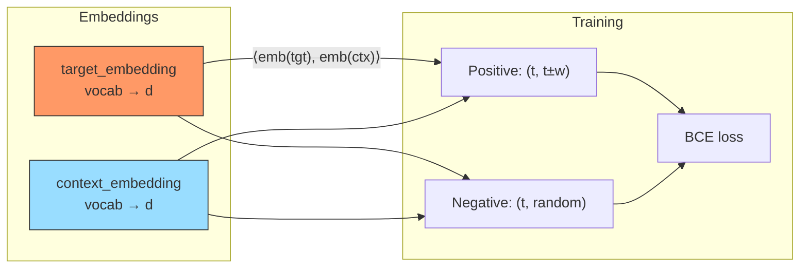

# Word2Vec (Skip-gram with Negative Sampling)

## Model Architecture

Learns item embeddings from behavior sequences:



### Skip-gram

For each target item at position `t`, predict context items within a window:

```
window_size = 5
context = seq[t-5:t] + seq[t+1:t+6]
```

### Final Embedding

After training, the item embedding is the average of target and context:

```python
item_emb = (target_embedding[id] + context_embedding[id]) / 2
```

## Configuration

```yaml
mlp:
  item_field: user_movie_rate   # behavior sequence field
```

Hyperparameters (hardcoded in trainer):
- `window_size = 5`
- `num_neg = 5`

## Launch

```bash
python -m gerbil_train.cli.32-word2vec_train --config configs/32-word2vec/experiment.yaml
```

## References

- Mikolov, T., et al. "Distributed Representations of Words and Phrases and their Compositionality." NIPS 2013.
