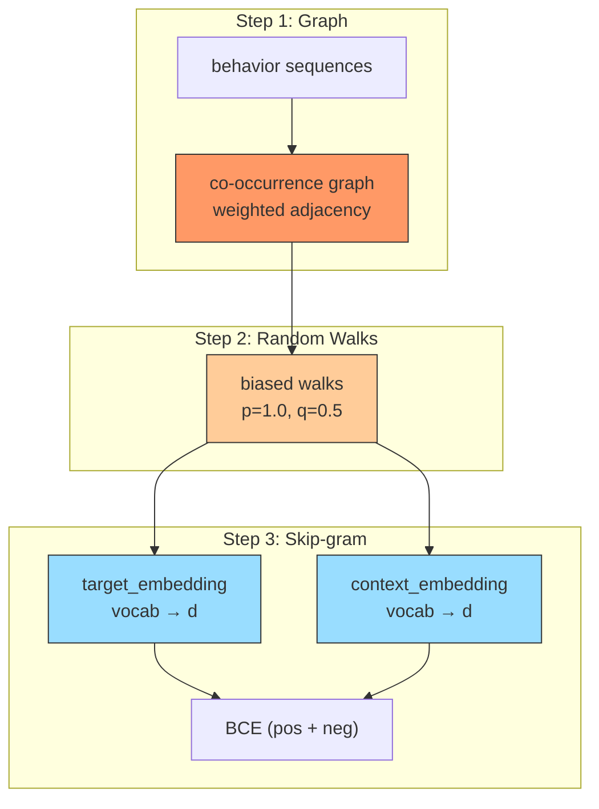

# Node2Vec

## Model Architecture

Node2Vec = biased random walks + Skip-gram



### Biased Random Walk

At node v (came from t), transition to x with weight:

```
    ┌ 1/p  if x == t         (return)
w = ┤ 1    if x is neighbor of t  (local)
    └ 1/q  otherwise          (explore)
```

- **p < 1**: walk tends to return to previous node (BFS-like)
- **q < 1**: walk tends to explore outward (DFS-like)
- **p = 1, q = 0.5**: default — moderate outward exploration

## Configuration

```yaml
mlp:
  item_field: user_movie_rate
```

Hyperparameters (hardcoded in trainer):
- `num_walks = 50` (per node)
- `walk_length = 20`
- `p = 1.0`, `q = 0.5`
- `window_size = 5`, `num_neg = 5`

## Launch

```bash
python -m gerbil_train.cli.33-node2vec_train --config configs/33-node2vec/experiment.yaml
```

## References

- Grover, A., and Leskovec, J. "node2vec: Scalable Feature Learning for Networks." KDD 2016.
