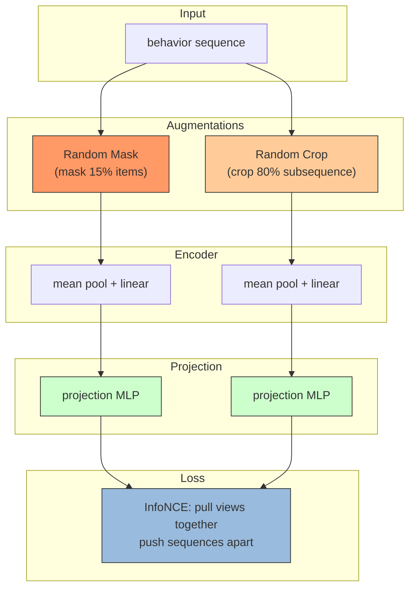

# SSL (Self-Supervised Learning) for Sequential Recommendation

## Model Architecture

SSL uses **contrastive learning** on behavior sequences:



### Contrastive Learning

Each sequence generates two augmented views (mask + crop).
Views from the same sequence are positive pairs; views from different
sequences are negative pairs. InfoNCE loss:

```
sim = cosine_similarity(z1, z2) / temperature
loss = CE(sim, labels) + CE(sim.T, labels)
```

### Augmentations

| Augmentation | Description | Ratio |
|-------------|-------------|-------|
| Random Mask | Replace random items with [MASK] token | 15% |
| Random Crop | Take a random 80% contiguous subsequence | 80% |

## Configuration

```yaml
mlp:
  item_field: user_movie_rate
  temperature: 0.5
  mask_ratio: 0.15
```

## Launch

```bash
python -m gerbil_train.cli.34-ssl_train --config configs/34-ssl/experiment.yaml
```

## References

- Xie, X., et al. "Contrastive Learning for Sequential Recommendation." arXiv 2021.
- Yao, T., et al. "Self-Supervised Learning for Sequential Recommendation." 2021.
