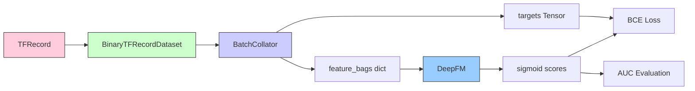

# DeepFM

## 数学公式

DeepFM = **bias + 一阶线性项 + FM二阶交叉项 + Deep深度MLP项** 四部分相加

DeepFM 将预测：

$$ \hat{y} = \text{bias} + \underbrace{\sum_{i} w_i \cdot e_i^{\text{linear}}}_{\text{一阶线性}} + \underbrace{\frac{1}{2}\sum_{i} \sum_{j \neq i} \langle e_i, e_j \rangle}_{\text{二阶 FM 交互}} + \underbrace{\text{MLP}([e_1, e_2, ..., e_n])}_{\text{Deep 项}} $$

embedding符号区分

- $e_i^\text{linear}$：一阶线性用的是**单独线性/一阶embedding参数**
- $e_1,e_2...e_n$：二阶FM & Deep分支用**共享的field embedding向量**。DeepFM核心就是**FM分支和Deep分支共享底层embedding**


或者


$\hat{y} = b + \sum_i w_i x_i + \frac12\left[\left(\sum_i \boldsymbol{v}_i x_i\right)^2 - \sum_i (\boldsymbol{v}_i x_i)^2\right] + \text{MLP}(\boldsymbol{v}_1 x_1, \boldsymbol{v}_2 x_2, ..., \boldsymbol{v}_n x_n)$

- $b$：全局偏置 bias
- $\sum w_i x_i$：一阶线性项
- $x_i$ ：one-hot向量
- $w_i$：一阶线性用的是单独线性/一阶embedding参数
- $\boldsymbol{v}_i$：二阶FM & Deep分支共享field embedding向量
- MLP：深度网络分支

(1) 二阶原始写法是双重循环 $\boldsymbol{\sum_i\sum_{j\neq i}}$，存在冗余计算。原始双重求和写法**数学结果正确**，但不是工程实现写法，会造成 $O(n^2)$ 复杂度，实际DeepFM代码都是用上面化简公式实现

标准FM公式等价化简：$\displaystyle \frac12\sum_i\sum_{j\neq i}\langle e_i,e_j\rangle = \frac12\left[\left(\sum_i e_i\right)^2-\sum_i e_i^2\right]$


**一阶线性项：** 每个字段独立做维度为 1 的 EmbeddingBag 求和

$$ y_{linear} = \text{bias} + \sum_{i=1}^{n} \text{EmbeddingBag}_i^{\text{linear}}(indices_i, offsets_i, weights_i) $$

$$ \quad\quad = b + \sum_{i=1}^{n} w_i \cdot e_i^{(1)} \quad e_i^{(1)} \in \mathbb{R} $$

**二阶 FM 交互项：** 所有字段的特征 embedding 做 pairwise dot product

$$ y_{FM} = \frac{1}{2} \sum_{i=1}^{n} \sum_{j=1}^{n} \langle e_i, e_j \rangle $$

$$ \quad\quad = \frac{1}{2} \left[ \big( \sum_{i=1}^{n} e_i \big)^2 - \sum_{i=1}^{n} e_i^2 \right] \quad e_i \in \mathbb{R}^{d} $$

**Deep 项：** 所有字段 embedding 拼接后经过 MLP

$$ y_{deep} = \text{head}(\text{MLP}( [e_1, e_2, ..., e_n] )) $$


## 注意事项

可见FM部分是对所有特征域进行两两交叉组合。一共包括N(N-1)/2个内积的累计和，是否发生logit很大问题？


## 模型架构

```mermaid
graph TB
    subgraph "Output"
        OUT["Output<br/>sigmoid"]
    end

    subgraph "Fusion"
        ADD["+"]
    end

    subgraph "First_Order"
        L1["LinearEmbeddingBag<br/>dim=1"]
        L2["LinearEmbeddingBag<br/>dim=1"]
        L3["LinearEmbeddingBag<br/>dim=1"]
        L_SUM["sum"]
    end

    subgraph "FM_Second_Order"
        F1["FeatureEmbeddingBag<br/>dim=emb_dim"]
        F2["FeatureEmbeddingBag<br/>dim=emb_dim"]
        F3["FeatureEmbeddingBag<br/>dim=emb_dim"]
        FM["FM Interaction<br/>½("(Σe")² - Σ("e²)")"]
    end

    subgraph "Deep"
        D_CONCAT["Concat"]
        D_MLP["MLP: 128 → 64"]
        D_HEAD["Linear Head"]
    end

    subgraph "Input"
        I1["user_id<br/>indices/offsets/weights"]
        I2["item_id<br/>indices/offsets/weights"]
        I3["gender<br/>indices/offsets/weights"]
    end

    I1 --> L1 & F1
    I2 --> L2 & F2
    I3 --> L3 & F3

    L1 & L2 & L3 --> L_SUM
    L_SUM --> ADD

    F1 & F2 & F3 --> FM
    FM --> ADD

    F1 & F2 & F3 --> D_CONCAT
    D_CONCAT --> D_MLP --> D_HEAD --> ADD

    ADD --> OUT
    BIAS["global bias"] --> ADD

    style OUT fill:#4a9,stroke:#333
    style ADD fill:#fc9,stroke:#333
    style L_SUM fill:#f9d,stroke:#333
    style FM fill:#9df,stroke:#333
    style D_MLP fill:#9bd,stroke:#333
```


## 数据流程




## 启动命令

```bash
python -m gerbil_train.cli.5-deepfm_train --config configs/5-deepfm/experiment.yaml
```
