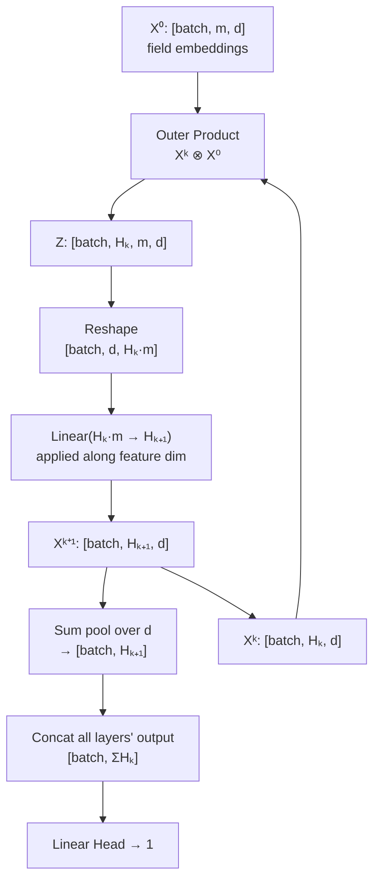

# xDeepFM (eXtreme Deep Factorization Machine)

## Model Architecture

xDeepFM replaces DeepFM's FM term with a **Compressed Interaction Network (CIN)**, which learns explicit feature interactions at the vector-wise level across multiple orders.

```mermaid
graph TB
    subgraph Output
        OUT[Output<br/>sigmoid]
    end

    subgraph Linear
        L_SUM[sum of linear embeddings<br/>1st-order]
    end

    subgraph CIN
        CIN_IN[Field embeddings<br/>batch, m, d]
        CIN_OP[Outer product ⊗<br/>X^k ⊗ X^⁰]
        CIN_FC[Linear compress<br/>H_k×m → H_{k+1}]
        CIN_POOL[Sum pooling<br/>over embedding dim]
    end

    subgraph Deep
        D_CONCAT[Concat all field embs]
        D_MLP[MLP]
        D_HEAD[Linear Head]
    end

    subgraph Input
        FB[feature_bags dict]
    end

    FB --> L_SUM --> OUT
    FB --> CIN_IN --> CIN_OP --> CIN_FC --> CIN_POOL --> OUT
    FB --> D_CONCAT --> D_MLP --> D_HEAD --> OUT

    style OUT fill:#4a9,stroke:#333
    style CIN_OP fill:#fc9,stroke:#333
    style CIN_FC fill:#f96,stroke:#333
    style CIN_POOL fill:#cfc,stroke:#333
    style D_MLP fill:#9bd,stroke:#333
```

### CIN (Compressed Interaction Network)

The core innovation of xDeepFM. CIN generates feature interactions at multiple orders (1st, 2nd, 3rd, ...) explicitly.



### Three Contributions

$$ \hat{y} = \underbrace{w_0 + \sum_i w_i \cdot x_i}_{\text{Linear (1st-order)}} + \underbrace{\text{CIN}([e_1, e_2, ..., e_m])}_{\text{Explicit multi-order interactions}} + \underbrace{\text{MLP}([e_1, e_2, ..., e_m])}_{\text{Implicit high-order interactions}} $$

### CIN Math

**Layer computation:**

$$ X^{k+1}_{p,*} = \sum_{i=1}^{H_k} \sum_{j=1}^{m} W^{k+1}_{p,i,j} \cdot (X^k_{i,*} \odot X^0_{j,*}) $$

where:
- $X^0 \in \mathbb{R}^{m \times d}$ — original field embeddings
- $X^k \in \mathbb{R}^{H_k \times d}$ — k-th hidden layer ($H_0 = 1$)
- $W^{k+1} \in \mathbb{R}^{H_{k+1} \times H_k \times m}$ — learned filters
- $\odot$ — element-wise multiplication along embedding dimension

**Layer output:**

$$ p^k = \sum_{t=1}^{d} X^k_{:,t} \in \mathbb{R}^{H_k} $$

**CIN output (concatenation of all layers):**

$$ \text{CIN}(X^0) = [p^1, p^2, ..., p^T] \in \mathbb{R}^{\sum_{k} H_k} $$

## Comparison: DeepFM vs xDeepFM

| Dimension | DeepFM | xDeepFM |
|-----------|--------|---------|
| Interaction | FM (bit-wise) | **CIN (vector-wise)** |
| Multi-order | Only 2nd-order | **1st, 2nd, ..., T-th order** |
| Explicit/Implicit | FM explicit + MLP implicit | CIN explicit + MLP implicit |
| Per-field control | Wide/Deep flags | Wide/Deep flags |
| Comp., expressiveness | O(mkd) | O(mkHd) |

## Data Pipeline

Same as DeepFM/GwEN — uses `feature_bags` dict from TFRecord.

## Configuration

```yaml
# configs/5-xdeepfm/model.yaml
task: binary
output:
  activation: sigmoid
  cin_layer_units:
    - 128
    - 128

mlp:
  hidden_dims: [256, 128]
  activation: relu
  dropout: 0.1
  batch_norm: true
  input_batch_norm: true

field_attention:
  enabled: false
```

### CIN Parameters

| Config | Default | Description |
|--------|---------|-------------|
| `output.cin_layer_units` | `[128, 128]` | Number of feature maps per CIN layer |
| `output.activation` | `sigmoid` | Output activation |

## Launch

```bash
python -m gerbil_train.cli.5-xdeepfm_train \
  --config configs/5-xdeepfm/experiment.yaml
```

## Key Differences from DeepFM

| Aspect | DeepFM | xDeepFM |
|--------|--------|---------|
| FM replaced by | FM (2nd-order) | **CIN (multi-order)** |
| CIN parameters | None | `cin_layer_units` |
| Field embedding dim | All fields same for FM | All fields same for CIN |
| Wide/Deep control | ✅ | ✅ |
| `_continue` fields | ✅ | ✅ |
| Parameter count (base) | ~159k | **~1,299k** (CIN adds ~18k) |
