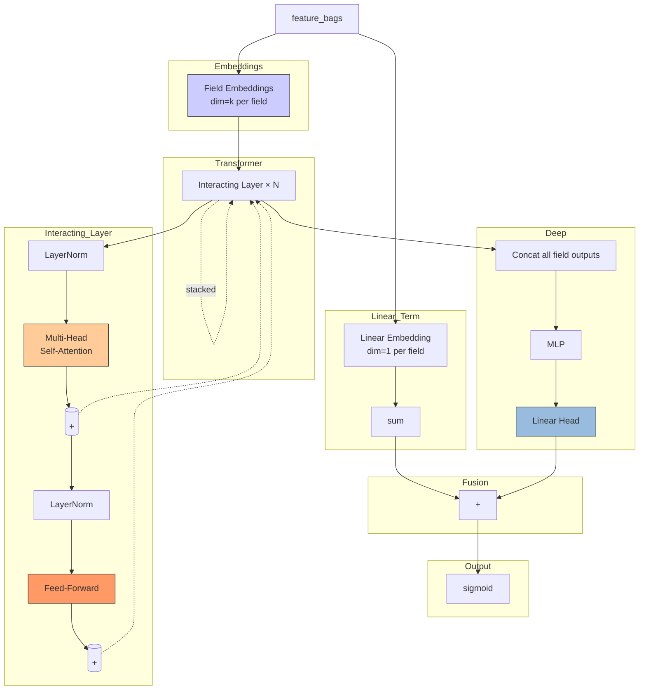

# AutoInt (Automatic Feature Interaction)

## Model Architecture

AutoInt treats each feature field as a **token** and uses **multi-head self-attention** (Transformer encoder) to automatically learn feature interactions at various orders.



### Multi-Head Self-Attention over Fields

Each attention head learns a different interaction pattern between fields:

$$ \text{head}_h = \text{softmax}\left(\frac{Q_h K_h^T}{\sqrt{d_k}}\right) V_h $$

$$ \text{MHA}(X) = \text{concat}(\text{head}_1, ..., \text{head}_H) W^O $$

### Interacting Layer (Transformer Encoder)

$$
\begin{aligned}
X' &= X + \text{MHA}(\text{LayerNorm}(X)) \\
X'' &= X' + \text{FFN}(\text{LayerNorm}(X'))
\end{aligned}
$$

## Configuration

```yaml
auto_attention:
  num_layers: 3      # number of stacked Transformer layers
  num_heads: 2       # number of attention heads
  attn_dim: 32       # attention dimension (must be divisible by num_heads)
  dropout: 0.0       # dropout rate

mlp:
  hidden_dims:
  - 128
  activation: relu
  dropout: 0.0
  batch_norm: false
  input_batch_norm: false
```

## Launch

```bash
python -m gerbil_train.cli.6-autoint_train --config configs/6-autoint/experiment.yaml
```

## Comparison with Other Models

| Model | Interaction Type | Mechanism |
|-------|----------------|-----------|
| FM | 2nd-order explicit | Pair-wise dot product |
| PNN | Explicit inner products | Product Layer + MLP |
| DeepFM | FM + MLP implicit | Shared embeddings |
| **AutoInt** | Multi-order **learned** | Transformer self-attention |
