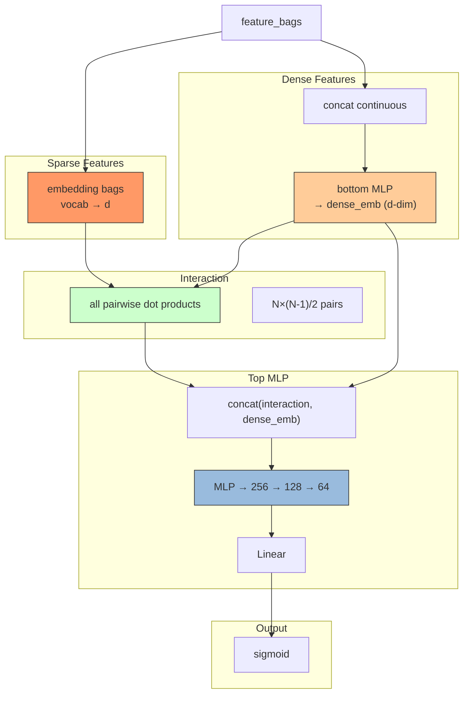

# DLRM (Deep Learning Recommendation Model)

## Model Architecture

DLRM processes sparse features (embeddings) and dense features (bottom MLP),
computes **all pairwise dot products**, and feeds them into a top MLP.



### Interaction Layer

For N features (each d-dim), computes all pairwise dot products:

```
gram = X · X^T        # [B, N, N]
interaction = upper_tri(gram, offset=1)  # [B, N(N-1)/2]
```

For N=40 features and d=8, this produces 780 interaction terms.

## Configuration

```yaml
mlp:
  bottom_hidden: [128, 64]    # dense → d-dim vector
  top_hidden: [256, 128, 64]  # interaction + dense → prediction
```

## Launch

```bash
python -m gerbil_train.cli.6-dlrm_train --config configs/6-dlrm/experiment.yaml
```

## References

- Naumov, M., et al. "Deep Learning Recommendation Model for Personalization and Recommendation Systems." RecSys 2019.
