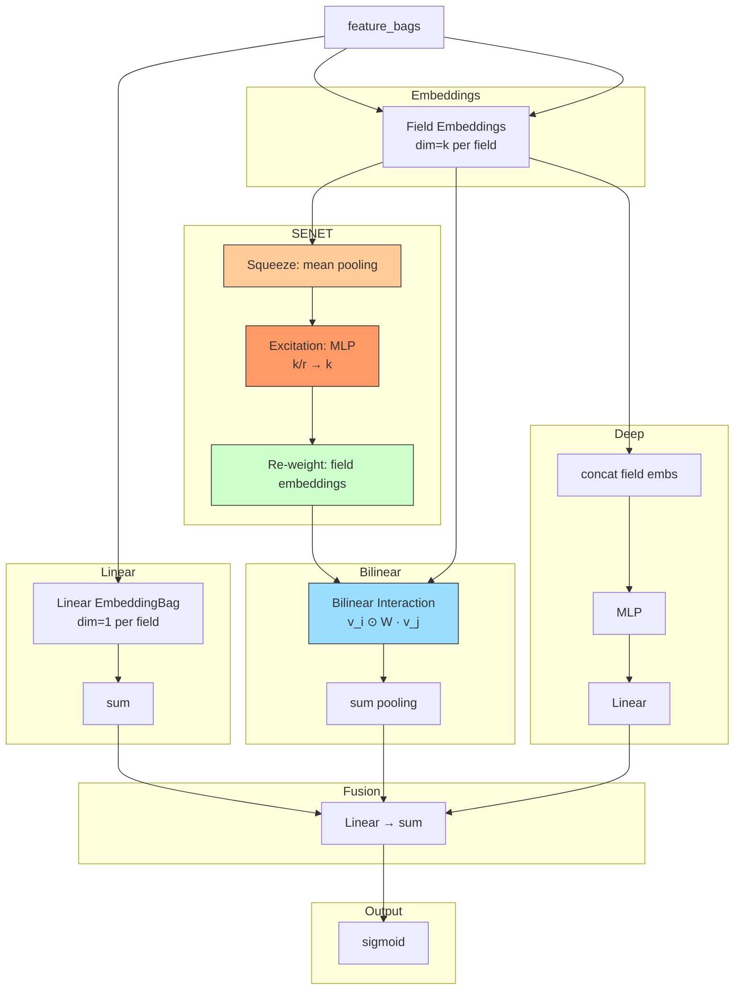

# FiBiNet (Feature Importance and Bilinear Interaction Network)

## Model Architecture

FiBiNet = **SENET** (field-level importance weighting) + **Bilinear Interaction** (learned pair-wise product) + **Deep MLP**.



### 1. SENET Layer (Feature Importance)

Learn which fields matter more:

```
Squeeze:   z = mean_pool(E)                    # [B, k]
Excitation: s = sigmoid(W₂ · ReLU(W₁ · z))     # [B, k]
Re-weight:  E' = s ⊙ E                         # [B, k] per field
```

### 2. Bilinear Interaction

Replaces standard dot product (FM) with a learnable bilinear transformation:

For each field pair (i, j):
```
p_ij = v_i ⊙ W · v_j
```

Three variants:
- **Field-All**: single W shared by all pairs
- **Field-Each**: separate W a per field (no pair-specific)
- **Field-Interaction**: separate W_ij per pair (most expressive)

FiBiNet sums all pair scores:
```
bilinear_out = Σ_{i<j} p_ij
```

### 3. Deep MLP

Standard concatenation of all field embeddings → MLP.

## Configuration

```yaml
field_attention:
  senet_reduction: 3       # SENET squeeze/excitation ratio
  bilinear_type: field_all # {field_all, field_each, field_interaction}

mlp:
  hidden_dims: [256, 128]
  activation: relu
  dropout: 0.1
  batch_norm: true
  input_batch_norm: true
```

## Launch

```bash
python -m gerbil_train.cli.6-fibinet_train --config configs/6-fibinet/experiment.yaml
```

## Comparison

| Model | Feature Weighting | Pair-wise Interaction |
|-------|------------------|----------------------|
| FM | None | Dot product |
| AFM | Attention scores | Weighted dot product |
| PNN | None | Inner/outer product |
| **FiBiNet** | **SENET (learned)** | **Bilinear (learned W)** |
