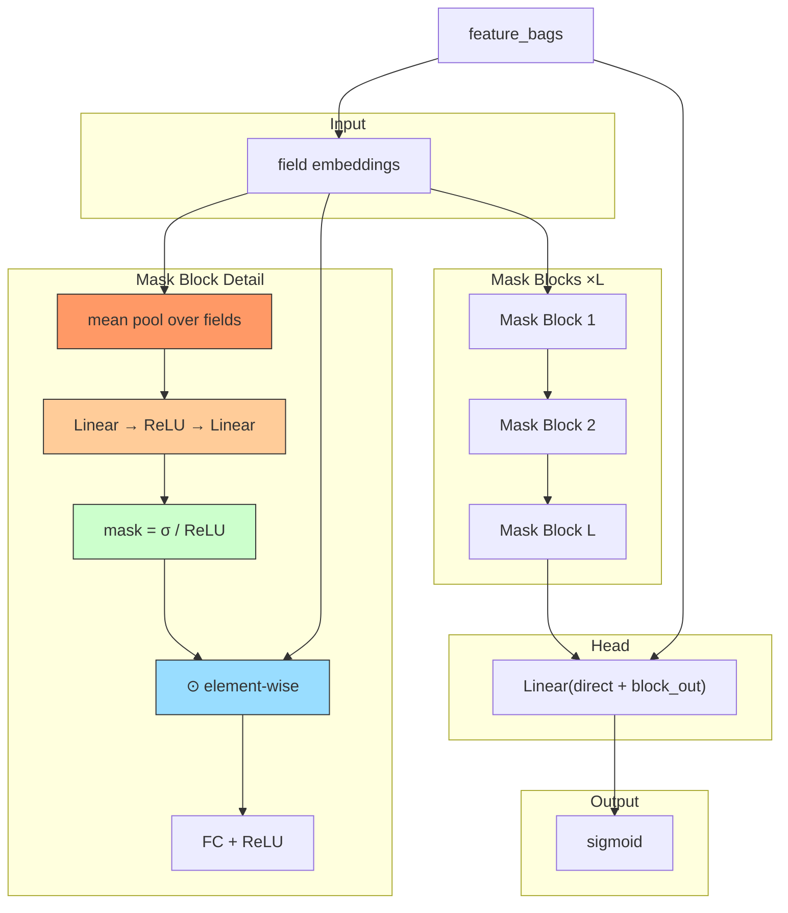

# MaskNet

## Model Architecture

MaskNet uses **instance-guided mask blocks**: each sample generates its own
mask from its feature embeddings, applies it element-wise, then passes through
a FC layer.



### Instance-Guided Mask

```
M = ReLU(W_2 · LayerNorm(mean_pool(E)) + b_2)    # sample-dependent
E_masked = E ⊙ M                                    # element-wise
output = ReLU(W_1 · E_masked + b_1)                 # FC
```

## Comparison

| Model | Interaction | Instance-dependent | Mask |
|-------|------------|-------------------|------|
| DCN | Cross network | No | No |
| AutoInt | Self-attention | Yes | Attention |
| **MaskNet** | **Instance mask + FC** | **Yes** | **Feature-level mask** |

## Configuration

```yaml
mlp:
  num_blocks: 2
  mask_hidden: [256]
  reduction_ratio: 4
```

## Launch

```bash
python -m gerbil_train.cli.6-masknet_train --config configs/6-masknet/experiment.yaml
```
