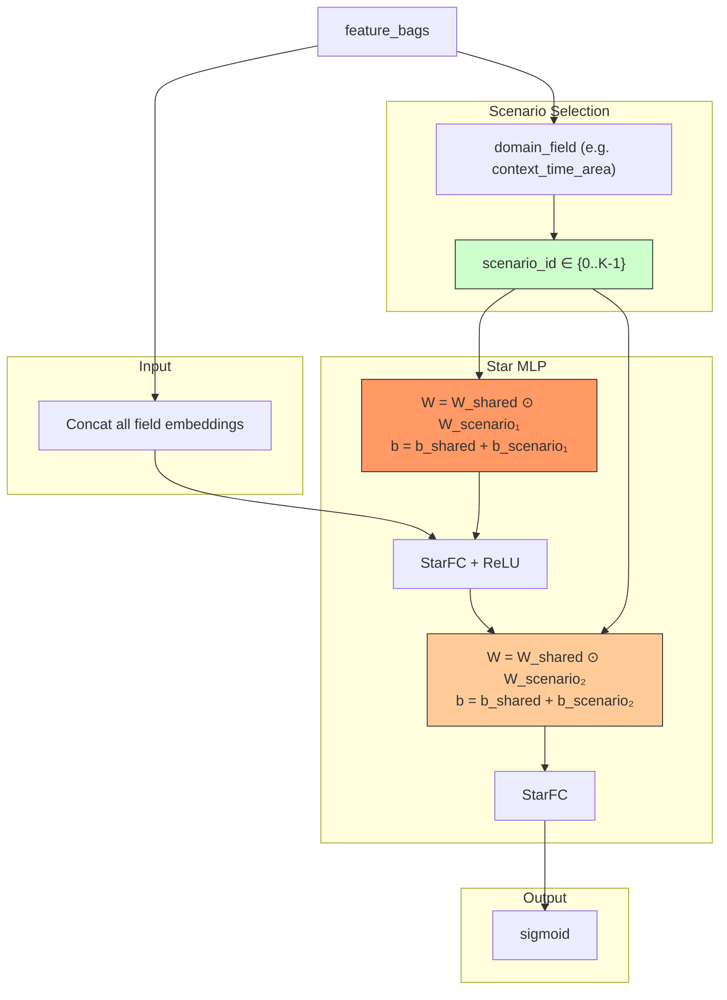

# STAR (Star Topology Adaptive Recommender)

## Model Architecture

STAR uses a **star topology** neural network for multi-scenario CTR:

```
W_eff = W_shared ⊙ W_scenario
b_eff = b_shared + b_scenario
```



### Parameter Composition

```
Layer 1 (shared):    W_shared_1, b_shared_1
Layer 1 (scenario):  W_scenario_1[s], b_scenario_1[s]
Layer 1 (effective): W = W_shared_1 ⊙ W_scenario_1[s]
                     b = b_shared_1 + b_scenario_1[s]
```

## Configuration

```yaml
mlp:
  domain_field: context_time_area   # scenario indicator
  hidden_dims: [128, 64]
  num_scenarios: 7                  # K scenarios
```

## Launch

```bash
python -m gerbil_train.cli.6-star_train --config configs/6-star/experiment.yaml
```

## References

- Sheng, X., et al. "STAR: Star Topology Adaptive Recommender." WSDM 2022.
