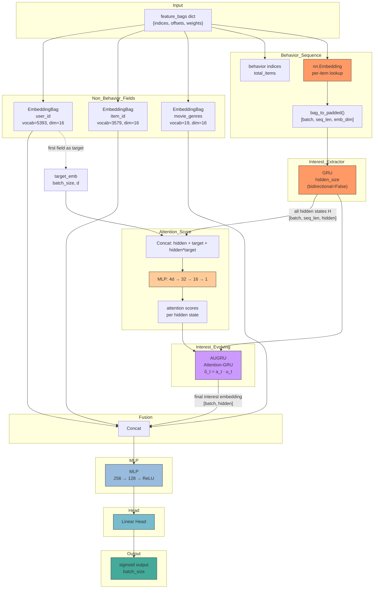

# DIEN (Deep Interest Evolution Network)

核心思想：用户的兴趣是随时间演化的。DIN 对行为序列做了 attention 加权，但忽略了行为之间的时序依赖。DIEN 用 GRU 建模行为序列的演化过程，再用 AUGRU（Attention GRU）筛选与当前候选物品相关的兴趣演化路径。

## 模型架构

```
                               ┌─────────────────────────────────────┐
                               │          Output (sigmoid)           │
                               └─────────────────┬───────────────────┘
                                                 │
                                             ┌───┴───┐
                                             │  MLP  │
                                             └───┬───┘
                                                 │
                                   concat(all_emb, interest_emb)
                                                 │
                      ┌──────────────────────────┴──────────────────────────┐
                      │                                                     │
                 ┌────┴─────┐                                    ┌─────────┴─────────┐
                 │Embedding │                                    │ Interest Evolving │
                 │Bag (sum) │                                    │                    │
                 │          │                                    │   ┌───────────┐   │
                 │user_id 8d│                                    │   │  AUGRU    │   │
                 │item_id 8d│                                    │   │ (attention│   │
                 │gender 4d│                                     │   │  GRU)     │   │
                 │age 4d   │                                     │   └─────┬─────┘   │
                 │  ...    │                                     │         │         │
                 └────┬─────┘                                    │   ┌─────┴─────┐   │
                      │                                           │   │ Attention │   │
                      │                                           │   │  Score    │   │
                      │                                           │   └─────┬─────┘   │
                      │                                           │         │         │
                      │                                           │   ┌─────┴─────┐   │
                      │                                           │   │    GRU    │   │
                      │                                           │   │ Extractor │   │
                      │                                           │   └───────────┘   │
                      │                                           └─────────┬─────────┘
                      │                                                     │
                feature_bags dict                                  behavior sequence
             (indices, offsets, weights)                           (indices + offsets)
```



## 核心组件

### 1. Interest Extractor（GRU）

对行为序列进行 RNN 建模，捕获兴趣随时间的演化轨迹：

```
GRU: e_k = GRU(e_{k-1}, x_k)
```

输入：`[batch, seq_len, emb_dim]`（行为序列 embedding）
输出：所有时间步的隐藏状态 `[batch, seq_len, hidden_size]`

### 2. AUGRU（Attention GRU）

DIEN 的核心创新。用 target 对每个时间步的隐藏状态计算 attention 分数，然后用该分数调制 GRU 的更新门：

```
a_t = σ(MLP(h_t, target))          # attention 分数
u_t  = σ(W_u · h_t + U_u · c_{t-1} + b_u)    # 标准 GRU 更新门
ũ_t  = a_t · u_t                              # attention 调制
c_t  = (1 - ũ_t) · c_{t-1} + ũ_t · c̃_t      # 状态更新
```

$u_t$ 是标准 GRU 的更新门，控制**多少历史信息流入新状态**。$a_t$ 是 attention 分数，表示**h_t 与 target 的相关性**。AUGRU 用 $ũ_t = a_t · u_t$ 代替 $u_t$，当 $a_t$ 很小时，即使 $u_t$ 很大也会被抑制，使无关的兴趣演化不会流入最终状态。

### 3. Auxiliary Loss（辅助损失）

每个行为序列的第 t 步 GRU 隐藏状态 $h_t$ 通过一个小的 MLP 预测第 t+1 步的 item，加入 auxiliary BCE loss：

$$L_{aux} = -\frac{1}{N}\sum_{i=1}^{N}\sum_{t=1}^{T_i}(\log \sigma(W_{aux}h_t^{i} + b) + \sum_{neg}\log(1 - \sigma(W_{aux}h_t^{i} + b_{neg})))$$

总损失 = BCE + $\alpha L_{aux}$，其中 $\alpha$ 是 auxiliary weight。

## 核心公式

**非行为字段嵌入：** 与 GwEN/DIN 一致

$$ e_j = \text{EmbeddingBag}(\text{field}_j, \text{indices}, \text{offsets}, \text{weights}) $$

**行为序列：**

$$ \{x_1,...,x_m\} = \text{Embedding}(\text{behavior_indices}) $$

**Interest Extractor：**

$$ H = \{h_1,...,h_m\} = \text{GRU}(x_1,...,x_m) $$

**Attention 分数：**

$$ a_t = \text{MLP}(\text{concat}(h_t, e^{target}, h_t \odot e^{target})) $$

**AUGRU 演化：**

$$ c_m = \text{AUGRU}(H, A) $$

最终状态 $c_m$ 就是兴趣 embedding `[batch, hidden_size]`。

**最终输出：**

$$ x = \text{concat}(e_1, ..., e_n, c_m) $$

$$ \hat{y} = \sigma(\text{MLP}(x)) $$

## 与 DIN 的差异

| 维度 | DIN | DIEN |
|------|-----|------|
| 行为序列建模 | 无（看成无序集合） | GRU 建模时序演化 |
| 兴趣表示 | 每个行为 item 的 embedding | GRU 隐藏状态序列 |
| 目标交互 | attention 在原始 item embedding 上计算 | attention 在 GRU 隐藏状态上计算 |
| 兴趣池化 | attention 权重加权求和 | AUGRU 演进到最后时间步 |
| 额外损失 | 无 | Auxiliary BCE loss（预测下一步） |
| 计算量 | O(L·d) | O(L·(d·h + h²)) — GRU 增加显著 |

## 数据处理流程

与 DIN 完全一致，行为序列通过 `bag_to_padded()` 转为 `[batch, seq_len]` 的 packed tensor，再通过 `nn.Embedding` 转为 `[batch, seq_len, emb_dim]`。

```python
# 1. 行为序列: flat indices → padded → embedding
indices = feature_bags[bf]["indices"]
offsets = feature_bags[bf]["offsets"]
padded_ids, lengths, max_seq_len = bag_to_padded(indices, offsets)
seq_emb = behavior_embedding(bf)(padded_ids)           # [batch, seq_len, emb_dim]

# 2. Interest Extractor: GRU
all_hidden = interest_extractor(seq_emb, lengths)      # [batch, seq_len, hidden]

# 3. AUGRU: attention scores → modulate GRU
att_scores = aux_unit(torch.cat([all_hidden, target_exp, all_hidden * target_exp], dim=-1))
interest = augru_cell(all_hidden, att_scores)          # [batch, hidden]
```

## AUGRU 实现细节

```python
class AUGRU(nn.Module):
    """Attention-based GRU.

    ũ_t = a_t · σ(W_u · x_t + U_u · h_{t-1} + b_u)
    """
    def __init__(self, input_size: int, hidden_size: int):
        super().__init__()
        self.input_size = input_size
        self.hidden_size = hidden_size
        self.gru_cell = nn.GRUCell(input_size, hidden_size)

    def forward(self, x: Tensor, att_scores: Tensor, lengths: Tensor) -> Tensor:
        """:param x: [batch, seq_len, input_size]
           :param att_scores: [batch, seq_len]
           :param lengths: [batch]
           :return: [batch, hidden_size]"""
        batch, seq_len, _ = x.shape
        h = torch.zeros(batch, self.hidden_size, device=x.device)
        for t in range(seq_len):
            mask = lengths > t                                 # valid positions
            h_prev = h * mask.unsqueeze(-1).float()
            h_candidate = self.gru_cell(x[:, t, :], h_prev)   # ̃h_t
            u_t = torch.sigmoid(...)                           # update gate
            u_tilde = att_scores[:, t].unsqueeze(-1) * u_t     # modulated gate
            h = (1 - u_tilde) * h_prev + u_tilde * h_candidate
        return h
```

注：GRUCell 内部参数可直接访问 `update_gate = σ(W_ih x + W_hh h + b)`，但 PyTorch 的 GRUCell 不直接暴露 reset/update gate。实际实现中需要手动实现 GRU 公式以获取更新门 $u_t$。

## 配置文件

```yaml
# configs/model/dien.yaml
task: binary
behavior_fields:
  - user_movie_rate
  - user_genres_rate
target_fields:
  - movie_id
  - movie_genres

embedding:
  default_emb_size: 16
  fields: {}

interest_extractor:
  hidden_size: 64
  num_layers: 1
  dropout: 0.0

local_activation_unit:
  hidden_dims: [32, 16]
  bias: [true, true]
  batch_norm: true
  activation: relu

mlp:
  hidden_dims: [256, 128]
  activation: relu
  dropout: 0.1
  batch_norm: true
  input_batch_norm: true
```

## 启动命令

```bash
python -m gerbil_train.cli.dien_train \
  --config configs/8-dien/experiment.yaml
```

## 前提条件

与 DIN 相同，数据中必须包含 `behavior_fields` 和 `target_fields`。GRU 参数量随 `hidden_size` 的平方增长，建议从 64 开始实验。AUGRU 需要在 CPU/GPU 上做序列维度的循环，seq_len 较长时注意性能。
