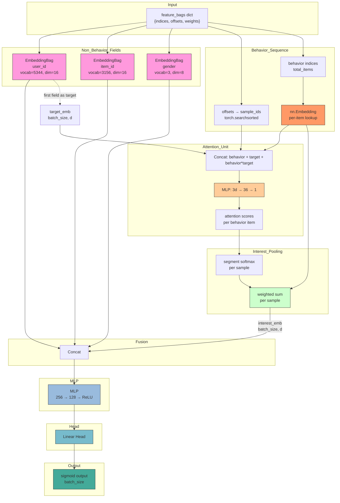
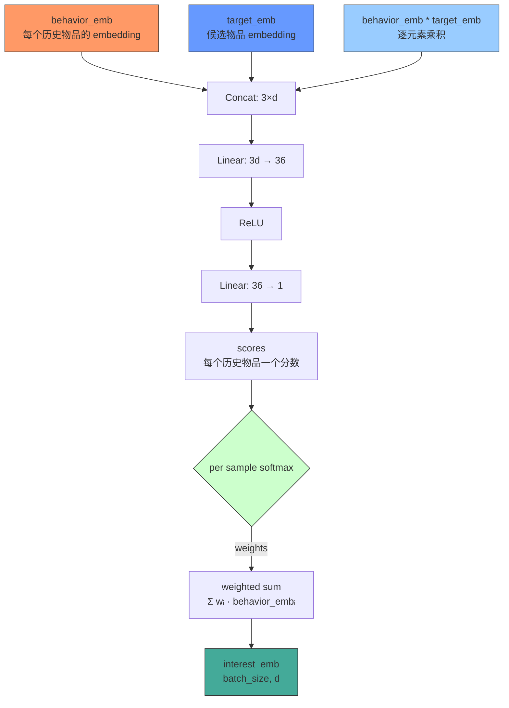

# DIN (Deep Interest Network)

核心思想：用户的行为序列中，不同行为对当前候选物品的预测贡献不同，通过 attention 机制自动学习每个历史行为的权重。

## 模型架构

```
                              ┌─────────────────────────────────────┐
                              │          Output (sigmoid)           │
                              └─────────────────┬───────────────────┘
                                                │
                                            ┌───┴───┐
                                            │  MLP  │
                                            └───┬───┘
                                                │
                                  concat(all_emb, interest_emb)
                                                │
                     ┌──────────────────────────┴──────────────────────────┐
                     │                                                     │
                ┌────┴─────┐                                    ┌─────────┴─────────┐
                │Embedding │                                    │ Attention Pooling │
                │Bag (sum) │                                    │                    │
                │          │                                    │ ┌──────────────┐  │
                │user_id 8d│                                    │ │ concat(      │  │
                │item_id 8d│                                    │ │  behav_emb,  │  │
                │gender 4d│                                     │ │  tgt_emb,    │  │
                │age 4d   │                                     │ │  prod        │  │
                │  ...    │                                     │ │ )→MLP→score  │  │
                └────┬─────┘                                    │ └──────┬───────┘  │
                     │                                           │        │          │
                     │                                           │ softmax│per sample │
                     │                                           │        │          │
                     │                                           │ ┌──────┴───────┐ │
                     │                                           │ │ weighted sum │ │
                     │                                           │ └──────────────┘ │
                     │                                           └─────────┬─────────┘
                     │                                                     │
               feature_bags dict                                  behavior sequence
            (indices, offsets, weights)                           (indices + offsets)
```



### 核心公式

**非行为字段嵌入：** 与 GwEN 一致，使用 EmbeddingBag

$$ e_j = \text{EmbeddingBag}(\text{field}_j, \text{indices}, \text{offsets}, \text{weights}) $$

**行为序列 attention score：** 每个历史行为物品与目标物品计算相似度得分

$$ a_k = \text{Att}(e_k^{behav}, e^{target}) $$

$$ \quad\quad = \text{MLP}_{att}(\text{concat}(e_k^{behav}, e^{target}, e_k^{behav} \odot e^{target})) $$

**兴趣池化：** 对每用户的行为序列做 softmax 后加权求和

$$ w_k = \frac{\exp(a_k)}{\sum_{j=1}^{m} \exp(a_j)} $$

$$ v_{interest} = \sum_{k=1}^{m} w_k \cdot e_k^{behav} \in \mathbb{R}^{d} $$

**最终输出：**

$$ x = \text{concat}(e_1, ..., e_n, v_{interest}) $$

$$ \hat{y} = \sigma(\text{MLP}(x)) $$

### Attention 单元细节



## 数据处理流程

与其他模型完全一致，行为序列字段以同样的 `{indices, offsets, weights}` 格式传入。模型内部对行为序列做 per-item 的 embedding lookup（而非 sum），再通过 attention 聚合。

```python
feature_bags = {
    "user_id":      {indices, offsets, weights},  # EmbeddingBag
    "item_id":      {indices, offsets, weights},  # EmbeddingBag
    "user_history": {indices, offsets, weights},  # DIN: nn.Embedding + attention
    ...
}
```

## 前向传播

```
1. 非行为字段: EmbeddingBag → concat → all_emb [batch_size, Σemb_dim]

2. 行为序列:
   a. nn.Embedding(lookup all behavior item indices) → [total_items, d]
   b. searchsorted(offsets) → sample_id per item
   c. target_emb[sample_id] → target vector for each behavior item
   d. attention_unit(concat(behavior, target, behavior*target)) → scores
   e. segment softmax per sample → weights
   f. weighted sum per sample → interest_emb [batch_size, d]

3. concat(all_emb, interest_emb) → MLP → sigmoid
```

### 核心代码

```python
# 将每个 behavior item 映射到所属 sample
arange = torch.arange(total_items, device=device)
sample_ids = torch.searchsorted(offsets, arange, right=True) - 1

# attention 分数
target_expanded = target_emb[sample_ids]
attn_input = torch.cat([behavior_embs, target_expanded, behavior_embs * target_expanded], dim=-1)
scores = self.attention_unit(attn_input).squeeze(-1)

# per-sample softmax + weighted sum
for i in range(batch_size):
    seg_scores = scores[start:end]
    seg_embs = behavior_embs[start:end]
    w = torch.softmax(seg_scores, dim=0)
    interest_list.append((seg_embs * w.unsqueeze(-1)).sum(dim=0))
```

## 与 GwEN 的差异

| 维度 | GwEN | DIN |
|------|-------|-----|
| 行为序列 | `EmbeddingBag` 直接求和 | `nn.Embedding` + attention pooling（支持多序列） |
| 输出 | `all_emb → MLP` | `concat(all_emb + interest_emb) → MLP` |
| 核心参数 | 无 | `behavior_fields` 指定序列字段列表 |
| 计算量 | O(B×F) | O(B×F + total_items×d) |

## 配置文件

```yaml
# configs/model/din.yaml
task: binary
behavior_fields:
  - click_history
  - view_history

embedding:
  default_emb_size: 16
  fields: {}

mlp:
  hidden_dims: [256, 128]
  activation: relu
  dropout: 0.1
  batch_norm: false
  input_batch_norm: false
```

## 启动命令

```bash
python3 -m gerbil_train.cli.din_train --config configs/4-din_train/experiment.yaml
```

## 前提条件

数据中必须包含 `behavior_fields` 中指定的所有字段，且这些字段为多值格式（行为序列）。每个字段独立做 attention 后拼接。如果数据中缺少任一字段，模型会报错。
