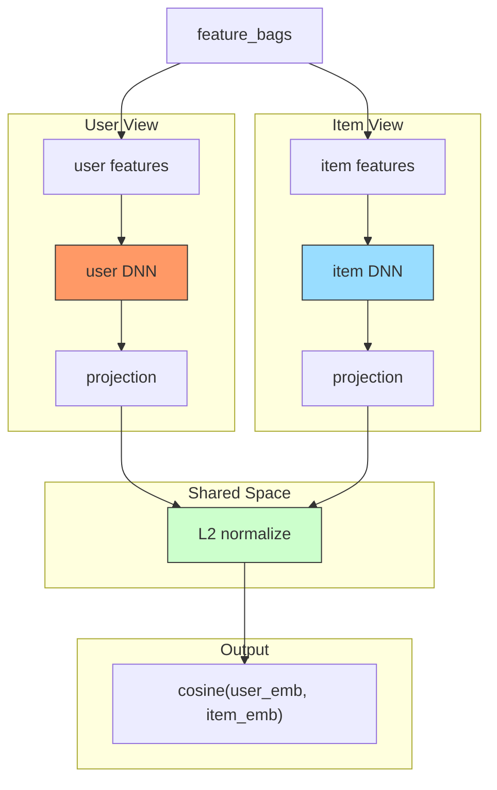

# MV-DNN (Multi-View Deep Neural Network)

## Model Architecture

MV-DNN learns separate user and item representations via independent DNNs:



### Training

BPR pairwise ranking loss with negative sampling:

```
loss = -mean(log(sigmoid(pos_score - neg_score)))
```

### Inference

User and item embeddings can be extracted separately for ANN retrieval:

```python
user_emb = model.encode_user(feature_bags)
item_emb = model.encode_item(feature_bags)
# → faiss / ANN search
```

## Configuration

```yaml
mlp:
  user_field: user_id
  item_field: movie_id
  user_side_fields: [user_age, user_gender, user_occupation]
  item_side_fields: [movie_title, movie_genres]
  user_hidden: [128, 64]
  item_hidden: [128, 64]
  embedding_dim: 16
```

## Launch

```bash
python -m gerbil_train.cli.99-mvdnn_train --config configs/99-mvdnn/experiment.yaml
```

## References

- Elkahky, A. M., et al. "Multi-View Deep Neural Network for Cross-View Learning." 2015.
