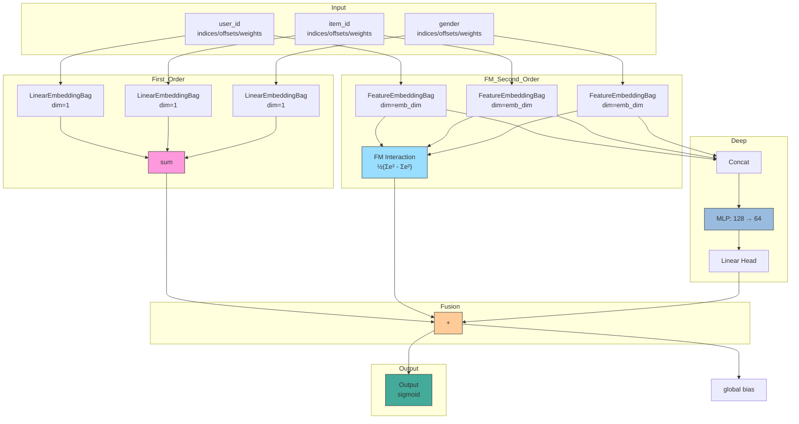
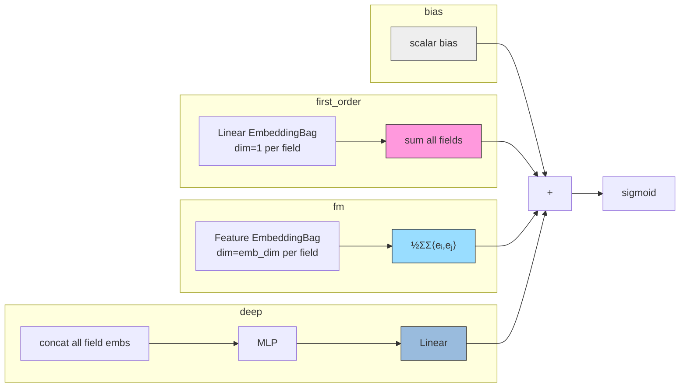
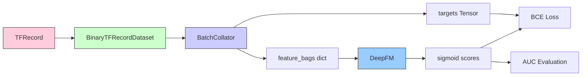

# DeepFM

## 模型架构

DeepFM 将预测拆为三项的加和：

$$ \hat{y} = \text{bias} + \underbrace{\sum_{i} w_i \cdot e_i^{\text{linear}}}_{\text{一阶线性}} + \underbrace{\frac{1}{2}\sum_{i} \sum_{j \neq i} \langle e_i, e_j \rangle}_{\text{二阶 FM 交互}} + \underbrace{\text{MLP}([e_1, e_2, ..., e_n])}_{\text{Deep 项}} $$

```
                                   ┌──────────────────────────┐
                                   │     Output (sigmoid)     │
                                   └────────────┬─────────────┘
                                                │
                          ┌─────────────────────┼─────────────────────┐
                          │                     │                     │
                     ┌────┴─────┐          ┌────┴──────┐         ┌───┴─────┐
                     │1st-order │          │2nd-order  │         │  Deep   │
                     │ (linear) │          │ FM (pair) │         │ (MLP)   │
                     └────┬─────┘          └────┬──────┘         └───┬─────┘
                          │                     │                     │
                          │       ┌─────────────┼─────────────┐       │
                          │       │             │             │       │
                     ┌────┴─────┐ │     ┌───────┴───────┐   │  ┌────┴─────┐
                     │  Linear  │ │     │   Feature     │   │  │  Concat  │
                     │Embedding │ │     │  Embedding    │   │  │ all embs │
                     │Bag(dim=1)│ │     │  Bag(emb_d)   │   │  └──────────┘
                     └────┬─────┘ │     └───────┬───────┘   │
                          │       │             │           │
                          └───────┼─────────────┼───────────┘
                                  │             │
                              ┌───┴──────┐  ┌───┴──────┐
                              │ user_id  │  │ user_id  │
                              │ item_id  │  │ item_id  │
                              │ gender   │  │ gender   │
                              │   ...    │  │   ...    │
                              └──────────┘  └──────────┘
```



### 三项贡献的分解

**一阶线性项：** 每个字段独立做维度为 1 的 EmbeddingBag 求和

$$ y_{linear} = \text{bias} + \sum_{i=1}^{n} \text{EmbeddingBag}_i^{\text{linear}}(indices_i, offsets_i, weights_i) $$

$$ \quad\quad = b + \sum_{i=1}^{n} w_i \cdot e_i^{(1)} \quad e_i^{(1)} \in \mathbb{R} $$

**二阶 FM 交互项：** 所有字段的特征 embedding 做 pairwise dot product

$$ y_{FM} = \frac{1}{2} \sum_{i=1}^{n} \sum_{j=1}^{n} \langle e_i, e_j \rangle $$

$$ \quad\quad = \frac{1}{2} \left[ \big( \sum_{i=1}^{n} e_i \big)^2 - \sum_{i=1}^{n} e_i^2 \right] \quad e_i \in \mathbb{R}^{d} $$

**Deep 项：** 所有字段 embedding 拼接后经过 MLP

$$ y_{deep} = \text{head}(\text{MLP}( [e_1, e_2, ..., e_n] )) $$

### 三项贡献的可视化



## 数据处理流程



## 前向传播

```python
logits = bias.expand(batch_size)

for fn in field_names:
    # 一阶项: LinearEmbeddingBag(dim=1)
    linear_emb = self.linear_embeddings[fn](indices, offsets, weights)
    logits += linear_emb.squeeze(-1)

    # Deep 和 FM 共享的 feature embedding
    feature_emb = self.feature_embeddings[fn](indices, offsets, weights)
    feature_emb_list.append(feature_emb)

# FM 二阶项
stacked = stack(feature_emb_list)                          # [B, N, D]
logits += 0.5 * (stacked.sum(1)² - (stacked²).sum(1)).sum(1)

# Deep 项
deep_input = concat(feature_emb_list)                      # [B, N×D]
logits += deep_head(MLP(deep_input))

return sigmoid(logits)
```

## 与重构前的区别

| 维度 | 重构前 | 重构后 |
|------|--------|--------|
| Embedding | `nn.Embedding`（单值） | `nn.EmbeddingBag`（多值，支持多值特征） |
| 输入格式 | `sparse_features: Tensor[B, N]` | `feature_bags: dict[str, {indices, offsets, weights}]` |
| 数据源 | MovieLens `.dat` 文件 | TFRecord |
| 验证指标 | NDCG@K（ranking 负采样） | AUC（pointwise） |
| 配置格式 | `sparse_fields` | `embedding.fields`（与 GwEN 一致） |

## 配置文件

```yaml
# configs/model/deepfm.yaml
task: binary
embedding:
  default_emb_dim: 16
  fields: {}

deep:
  hidden_dims: [128, 64]
  activation: relu
  dropout: 0.1
  batch_norm: false

output:
  activation: sigmoid
```

## 启动命令

```bash
python3 -m gerbil_train.cli.deepfm_train --config configs/experiment/deepfm_ml1m.yaml
```
