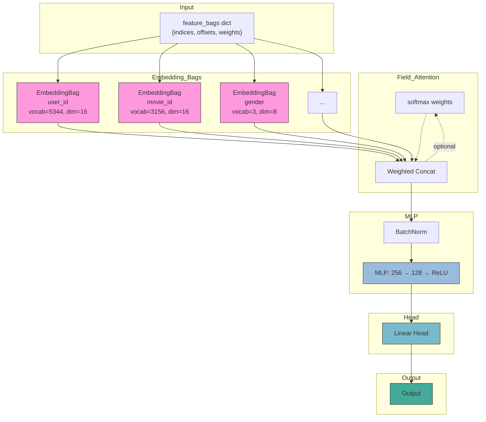
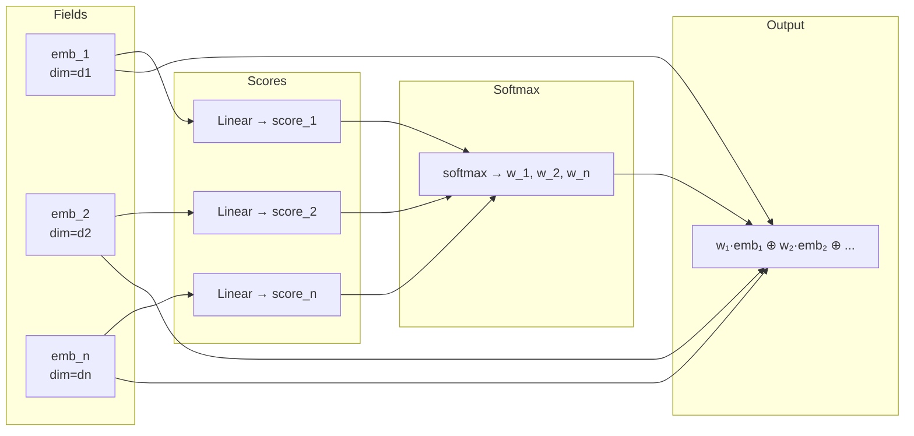
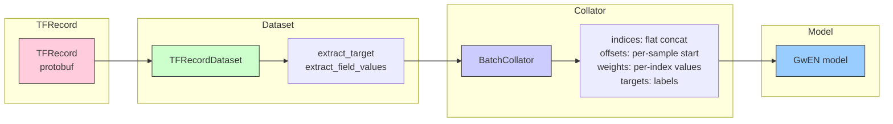
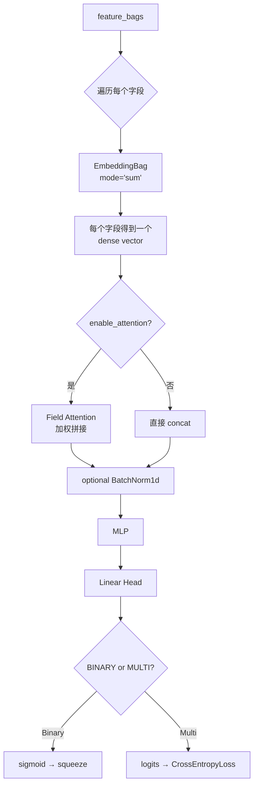

# GwEN (Group-wise Embedding Network)

## 模型架构



```
                         ┌─────────────────────────────────────┐
                         │          Output (sigmoid / logits)  │
                         └──────────────────┬──────────────────┘
                                            │
                                        ┌───┴───┐
                                        │ head  │
                                        └───┬───┘
                                            │
                                        ┌───┴───┐
                                        │  MLP  │
                                        └───┬───┘
                                            │
                                      concat(all field embeddings)
                                            │
                     ┌──────────────────────┼──────────────────────┐
                     │                      │                      │
                  ┌──┴────┐             ┌───┴───┐             ┌───┴───┐
                  │user_id│             │item_id│             │gender │
                  │Embed. │             │Embed. │             │Embed. │
                  │Bag 8d │             │Bag 16d│             │Bag 4d │
                  └───────┘             └───────┘             └───────┘
                     │                      │                      │
```

### 核心公式

**字段嵌入：** 每个字段的稀疏特征通过 EmbeddingBag 转换为稠密向量

$$ e_i = \text{EmbeddingBag}(\text{field}_i, \text{indices}, \text{offsets}, \text{weights}) \quad e_i \in \mathbb{R}^{d_i} $$

**向量拼接：** 各字段向量拼接后作为 MLP 输入

$$ x = \text{concat}(e_1, e_2, ..., e_n) \in \mathbb{R}^{\sum d_i} $$

**MLP 输出：**

$$ h = \text{MLP}(x) \in \mathbb{R}^{d_{hidden}} $$

**输出层：**

$$ \text{Binary:} \quad \hat{y} = \sigma(W_h \cdot h + b_h) \in [0, 1] $$

$$ \text{Multi-class:} \quad \text{logits} = W_h \cdot h + b_h \in \mathbb{R}^{C} $$

**可选 Field-level Attention：**

$$ w_i = \frac{\exp(\text{Linear}_i(e_i))}{\sum_j \exp(\text{Linear}_j(e_j))} $$

$$ x = \text{concat}(w_1 \cdot e_1, w_2 \cdot e_2, ..., w_n \cdot e_n) $$

### Field-level Attention（可选）

当 `attention.enabled = true` 时，每个字段的 embedding 经过可学习的线性层打分后加权拼接：



## 数据处理流程



```
TFRecord (protobuf)
    │
    ├── BinaryTFRecordDataset / MultiTFRecordDataset
    │   _extract_target()  →  target label
    │   _extract_field_values()  →  indices, values per field
    │
    └── BatchCollator
        indices  →  flat concat across batch  [total_items]
        offsets  →  per-sample start index     [batch_size]
        weights  →  per-index weight           [total_items]
        targets  →  target labels              [batch_size]
```

```python
feature_bags = {
    "user_id":   {"indices": Tensor[total_1], "offsets": Tensor[bs], "weights": Tensor[total_1]},
    "item_id":   {"indices": Tensor[total_2], "offsets": Tensor[bs], "weights": Tensor[total_2]},
    "gender":    {"indices": Tensor[total_3], "offsets": Tensor[bs], "weights": Tensor[total_3]},
    ...
}
targets = Tensor[bs]  # binary: 0.0 / 1.0  |  multiclass: class index
```

## 前向传播



## 与 DeepFM / DIN 的对比

| 维度 | GwEN | DeepFM | DIN |
|------|------|--------|-----|
| 特征交互 | 仅 MLP 隐式 | FM 显式二阶 + MLP | MLP + attention over behavior |
| 一阶项 | 无独立一阶 | `LinearEmbeddingBag(dim=1)` | 无独立一阶 |
| 行为序列支持 | EmbeddingBag 直接求和 | EmbeddingBag 直接求和 | nn.Embedding + attention pooling |
| 参数量 | 少 | 多（三套 embedding） | 中（多一套 attention） |
| 输入格式 | `feature_bags` dict | `feature_bags` dict | `feature_bags` dict |

## 两种输出头

### Binary (`GwENBinary`)

```python
self.head = nn.Linear(final_hidden_dim, 1)
return torch.sigmoid(self.head(hidden)).squeeze(-1)
```

### Multi-class (`GwEN`)

```python
self.head = nn.Linear(final_hidden_dim, target_size)
return self.head(hidden)  # logits, CrossEntropyLoss 内部做 softmax
```

训练时 multi-class 可选 `sampled_softmax` / `NCE loss`，从 `encode()` 取 hidden 输入 loss 函数，不经过 head：

```python
hidden = model.encode(feature_bags)
loss = sampled_softmax_loss(hidden, model.head.weight, targets, ...)
```

## 配置文件

```yaml
# configs/model/gwen_binary_model.yaml
task: binary
embedding:
  default_emb_dim: 16
  fields:
    user_id:
      f_index: 1
      f_type: 1
      vocab_size: 5344
      emb_dim: 16
      enabled: true
    movie_id:
      f_index: 101
      f_type: 1
      vocab_size: 3156
      emb_dim: 16
      enabled: true

mlp:
  hidden_dims: [256, 128]
  activation: relu
  dropout: 0.1
  batch_norm: false
  input_batch_norm: false

attention:
  enabled: false
```

## 启动命令

```bash
# Binary
python3 -m gerbil_train.cli.gwen_binary_train --config configs/experiment/gwen_ml1m_binary.yaml

# Multi-class
python3 -m gerbil_train.cli.gwen_multiclass_train --config configs/experiment/gwen_ml1m_multiclass.yaml
```
